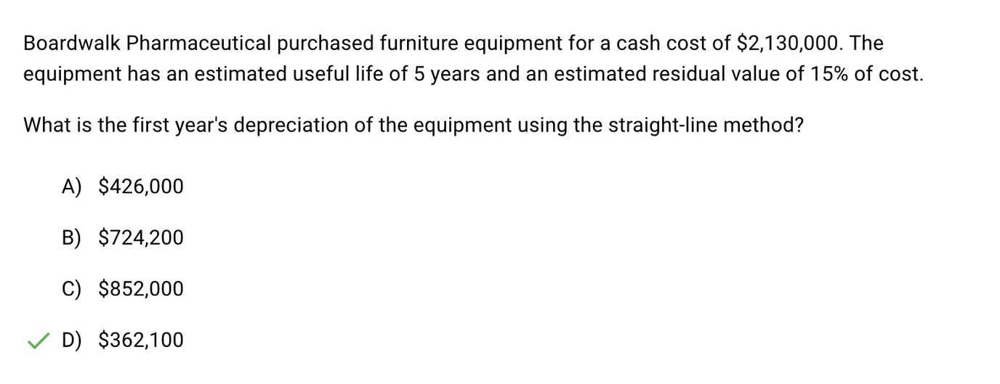
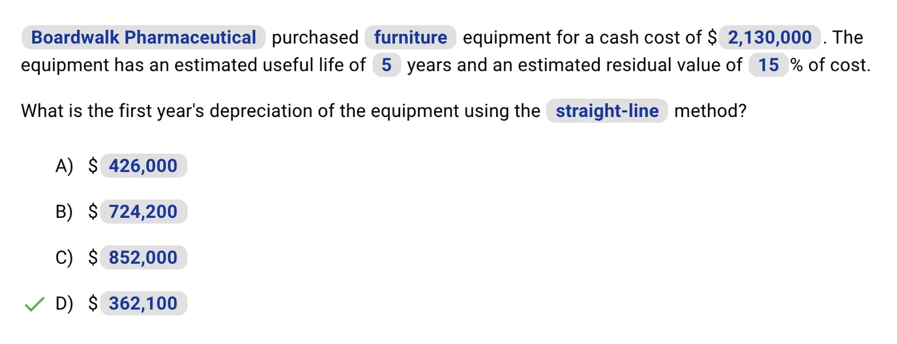

# Dynamic Overview

## Introduction

Today I’m going to show you how dynamic questions can revolutionize your digital assessments. I remember the first time I was introduced to dynamic questions. I was intrigued by the concept and I wanted to learn more. Dynamic questions are very different from question pools and random blocks.

Today I’m going to show you how dynamic questions can revolutionize your digital assessments. I remember the first time I was introduced to dynamic questions. I was intrigued by the concept and I wanted to learn more. Dynamic questions are very different from question pools and random blocks.

In this easy to follow guide, I’ll give you everything you need to know about dynamic questions. I’ll show you how using dynamic questions can save you time on future exams and how they can significantly improve the academic integrity of your course.

## Dynamic Questions

A _Dynamic Question_ is a question with randomized parameters. What that means is that variables within the question are randomly changed, based on a set of rules. With dynamic questions, you can randomize numbers, formulas, words, phrases, or anything else you can think of. The sky's the limit!

#### Why are Dynamic Questions So Important?

Dynamic questions are critical for maintaining academic integrity for 3 reasons:

1. Minimizing the advantage of group collaboration
2. Making it hard to find solutions online
3. Deterring students from posting questions online

Right now, universities are realizing that students are constantly finding ways around lockdown browsers and online proctoring. It’s a never-ending battle with no end in sight.

Once students find a way around technology that attempts to stop the “act” of cheating, they gain advantages through group collaboration and online websites. Some of the websites where exam questions and solutions can be found are [Chegg](https://www.chegg.com/), [Course Hero](https://www.coursehero.com/), and [Quizlet](https://quizlet.com/). At EXAMIND, we call this _compromised or vulnerable content_.

Dynamic questions are important because they help address both group collaboration and finding solutions online. With dynamic questions, every student receives a personalized question variant during their assessment.

Rather than trying to stop the “act” of cheating, dynamic questions focus on trying to eliminate the “advantage” of cheating. This approach transcends across assessment delivery methods, as it can be very effective for online exams delivered in-person as well.

## How They Work

Dynamic questions are not that complicated. Let’s go through an example. Below is a question based on an introduction course in accounting. But don’t worry if you never studied accounting. That’s not the point.The point is to show you how variables can be changed and explain their purpose.

<figure><figcaption>
Example of a multiple-choice question
</figcaption></figure>

Above is the original question with no dynamic variables. It doesn’t look much different than any other original (normal) question you might have on one of your exams, right? That’s by design. Dynamic questions don’t look or feel any different to a student on purpose. Now, here is the same question with the dynamic variables highlighted for you:

<figure><figcaption>
Example of a dynamic multiple-choice question
</figcaption></figure>

Notice that all of these highlighted variables have the potential to be changed into something else. By turning the highlighted variables into randomized parameters, we can make a large number of question variants from just this one original question. Are you starting to see the potential?

### Dependent & Independent Variables

Before we go through the exact steps on how to make a dynamic question, let’s take a closer look at the variables to understand how they affect the quality of the dynamic question.First, it is important to understand the difference between variables that have a direct effect on the answer choices and those that do not impact the answers at all.We call variables that influence the answer _"dependent variables"_. These are important because dependent variables change the correct and incorrect answer choices in a question, making collaboration more difficult.We call variables that don’t influence the answer _"independent variables"._ These are important because they can help identify students who are posting questions online (more on that later).A good dynamic question uses a mix of dependent and independent variables.In our example above, we have 4 dependent variables:

* Purchase price of the equipment is **$2,130,000**
* Useful life of the equipment is **5 years**
* Estimated residual value is **15% of cost**
* Depreciation method is **Straight-line**

With each new question variant, there is a new set of answer choices. The more variation we introduce into dependent variables, the greater the number of possible answers there are for students.We also have 2 independent variables in the example above.

* Company name is **Boardwalk Pharmaceutical**
* Type of equipment is **Furniture**

These variables do not affect the answer. What they do is make a question more identifiable. A question with more unique components makes it easier to identify which student posted your question online.

#### Why are independent variables critical?

One of the biggest challenges educators face today is compromised content. Students are sharing exams, assignments, and test bank questions online to collaborate on solutions and make it easier to cheat together. Without dynamic questions, they can do this anonymously.

With dynamic questions, the unique combination of dependent and independent variables create what we call a Digital Fingerprint. A digital fingerprint provides proof of which student compromised your content online. With this proof, we can have the content removed and take any other necessary actions.

Another benefit of independent variables is leveraging the paraphrasing effect. When we use paraphrased or altered questions, communicating in real time becomes more difficult.

During an exam, Student A may text Student B and say, “What did you get for the Boardwalk Pharmaceutical question?” The response would be, “I don’t have that question.” Then, Student A might try again with something like, “The one on straight-line depreciation”. To which the reply would be, “I got one on double-declining balance.”

You get the idea. The bottom line is that dynamic questions make collaboration more difficult, as students are receiving different variations of the question and confuse each other when communicating.

### **How are Answers Randomized?**

By now, we have shown you how you can randomize variables in the question stem. The next step is to show you how dynamic questions randomize the answer choices as well. More importantly, we should talk about creating “smart” answer choices.

Answer choices are randomized with dynamic questions. Not only do we randomize the order in which answers are presented, but we also tie the choices to the dependent variables in the question stem. In other words, if the Purchase Price changes, so does the calculated answer choice.

This becomes even more powerful when we use dynamic functional distractors. In other words, when we look at the above example, the answer choices calculate common mistakes that students make based on the variables in the question stem.

One common mistake is calculating the straight-line depreciation when the student should have calculated the double-declining balance, and vice versa. Things get really interesting when the stem changes from straight-line to double-declining balance, because the correct answer choice changes as well.

In both scenarios, both the straight-line and double-declining balance choices are presented. But the correct choice changes according to the question stem’s variable.

When we create dynamic functional distractors, we make a tremendous improvement to the question’s ability to discriminate knowledge.

## Create a Dynamic Question

### **Step 1: Write Question**

I’m pretty sure I don’t need to explain this one - just write your own question. What I like to do is repurpose some of my old exams. I just copy and paste the question into EXAMIND’s question builder.

### **Step 2: Identify Variables**

What I like to do is take a second to plan my variables. I usually write some ideas on a piece of paper. But generally speaking, this is what I do:

<figure><figcaption>
Table of variables and thought process
</figcaption></figure>

First, I pick which variables I want to change. Then, I give them a name so I remember when I’m building the rules. Lastly, I think about what rules I want the variable to follow.

### **Step 3: Specify Rules**

Now it’s time to get a little more specific. Here is what I did for each of the variables.

**Boardwalk Pharmaceutical**

This one is simple. I just need a random company name. This is an independent variable and EXAMIND makes it really easy for me to assign a random company name. [Book a demo](https://www.examind.io/schedule-demo) and we’ll show you how you can do this in under 5 seconds.

**Furniture**

For this one, it is a little more important that I control the list. If you know accounting, some equipment might not be considered depreciable. So I don’t want to select something from a random database of equipment.Instead, I tell EXAMIND to randomly pick any of the following:

* manufacturing
* furniture
* long-term office
* warehouse

#### **Purchase Price**

Another easy one! All I want to do is pick a random number between 10,000 and 10,000,000, in increments of 5,000. I could have picked any number range, but remember we want to try to make this realistic for the student. For this reason, I also made the increments stay nice and round, which are easier to work with.

#### **Useful Life**

Here I just want to set a range for the useful life that makes sense with accounting rules. In accounting you can’t depreciate something forever. So I just had to use some common sense. I ended up with a range of numbers between 3 and 10 years, in increments of 1 year.

#### **Residual Value**

All we need to do here is set the range for the residual value, in this case I’ll set it between 1 to 30%, in increments of 1%. Once again, we are trying to keep things realistic to the question.

#### **Depreciation Method**

Lastly, we tell EXAMIND to randomly pick the depreciation method as either straight-line or double-declining.So far so good? Let’s go to the last step, answers.

### **Step 4: Create Answers**

Similar to what we did in Step 3 for the variables in our question stem, now we have to specify the rules for the answer choices. First, let’s take a quick look at the question again.

<figure><figcaption>
Example of a dynamic multiple-choice question
</figcaption></figure>

In our example question, the correct choice is tied to the depreciation method. This is where it gets fun. We need to tell EXAMIND what formula to use to derive the answer, based on the depreciation method. Let’s get started.

#### **Correct Choice 1: Straight-line Depreciation**

If the question asks for straight-line depreciation, the correct is based on the formula used to calculate straight-line depreciation:

<figure><figcaption></figcaption></figure>

Which translates to...

<figure><figcaption></figcaption></figure>

#### **Correct Choice 2: Double-declining Balance Depreciation**

If the question asks for double-declining depreciation, the correct is based on the formula used to calculate double-declining depreciation:

<figure><figcaption></figcaption></figure>

Which translates to...

<figure><figcaption></figcaption></figure>

Notice how both the answer for straight-line depreciation ($362,100) and double-declining balance depreciation ($852,000) show up in the answer choices? This was by design. In order to create good functional distractors, you want to create incorrect answers that are commonly made mistakes. What other common mistakes do students make in this scenario?  They often forget to subtract the residual value when calculating straight-line depreciation. So we included this as one of the answer choices ($426,000). Another common mistake when calculating double-declining depreciation is to just simply multiply the straight-line depreciation by two. We also included this common mistake in the answer choices ($724,000). Now we have a really great question!

We have now turned an ordinary question into a dynamic question!

That’s it! Isn’t this amazing? Now you have nearly unlimited variations of your question!

In the above example we looked at a numerical question. Can we also create dynamic questions for non-numerical questions? The answer is a resounding yes! This is why what we are doing is so powerful. We aren’t limited to numerical questions. Let’s give it a try using the same steps we used before.

## **Dynamic Question Without Numbers**

Here is a question we designed for a finance cours:

<figure><figcaption>
Example of a multiple-choice question for finance
</figcaption></figure>

Now, here is the same question with the dynamic variables highlighted for you

<figure><figcaption>
Example of a dynamic multiple-choice question for finance
</figcaption></figure>

### **Step 1: Write Question**

Just copy and paste the above question into EXAMIND’s question builder.

### **Step 2: Identify Variables**

Once again we need to plan out which variables we are going to change. Below is a summary of the categories I created for this question:

<figure><figcaption>
Table of variables and thought process
</figcaption></figure>

Now that I have the variables I’m interested in, I need to specify the rules.&#x20;

### **Step 3: Specify Rules**

Here is what I did for each of the variables.&#x20;

#### **Personalized Technology**

This is an independent variable and all I need to do is have EXAMIND assign a random company name from a list of company names.

#### **LIFO, FIFO**

LIFO (Last In First Out) and FIFO (First In First Out) are types of accounting methods used to measure inventory. These are dependent variables because they directly impact our answer. The only rule we have to set up is to have EXAMIND randomly pick between LIFO and FIFO. If EXAMIND picks LIFO, then it will automatically compare it to FIFO.&#x20;

#### **Lower**

Here the question is simply asking the student to identify what ratio in the final answer will be lower. We want this variable to change between “higher” and “lower”. All we need to do is have EXAMIND randomly choose either “higher” or “lower” for the variable.&#x20;

#### **Inflationary**

Lastly, we have the term inflationary. This variable just tells us if prices are going up or down. If prices are going up we will call this variable “inflationary” and when they are going down “deflationary”. Now we tell EXAMIND to randomly pick either inflationary or deflationary.&#x20;

### **Step 4: Create Answers**

For this particular question, Step 3 was pretty straight forward. Step 4 of this question requires us to have a pretty in depth understanding of finance and accounting in order to specify the answer choices. Let’s make this as easy as possible.

First, we need to identify which ratios we are going to use as potential answers. For this question we are going to consider the following ratios:

* Acid Test Ratio
* Asset Turnover
* Current Ratio
* Days of Inventory on Hand
* Inventory Turnover&#x20;
* Gross Margin&#x20;

It doesn’t matter if you don’t understand what these ratios mean. Just try to understand how we are setting up the potential answers.

Now we need to tell EXAMIND when these answer choices are correct based on different scenarios. There are a lot of different scenarios in this question. For ease of discussion, I will only go through one scenario.

Let’s consider when the question asks us to use FIFO, when the direction of the ratio will be higher, and the cost environment is deflationary. In this scenario, there are three potentially correct answers and three potentially incorrect answers as follows:

#### **Scenario: FIFO, Higher, and Deflationary:**

<figure><figcaption>
Table of variables and thought process
</figcaption></figure>

Based on this scenario, we need to build some logic into EXAMIND. All we need to do is build some “if then” logic into EXAMIND. We tell EXAMIND that “if” the scenario is FIFO, Higher, and Deflationary, “then” randomly pick one of the correct answers from the correct answer list and then randomly select the remaining answer choices from the incorrect answer list. It is that easy!

We repeat this process for the other potential scenarios. However, each scenario will require us to create a new correct and incorrect answer list because the answers will change based on the scenarios.

That’s it! Now you have another dynamic question. This is a very powerful question because it requires the students to understand how accounting ratios change in different contexts.&#x20;

## **Conclusion**

Thanks to this easy to follow “Dynamic Questions: The Beginner’s Guide”, you now understand the power and potential of using dynamic questions and how easy it can be. You won’t need to spend hours creating versions of questions or exams. Following the steps outlined in this guide you can create unlimited new question variants and exam versions in a matter of minutes.

This approach allows you to easily give unique assessments to every student thereby increasing academic integrity because it makes it much more difficult for students to cheat.

Now you have everything you need to get started with building dynamic questions. At EXAMIND we are ready to help you start building dynamic questions and creating better exams in a fraction of the time. \
