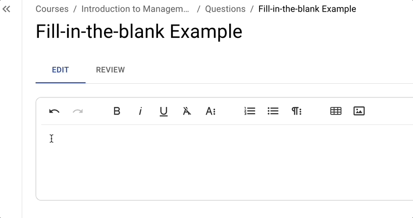
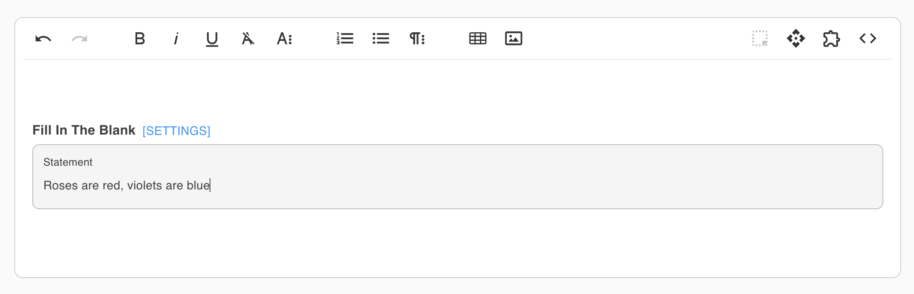
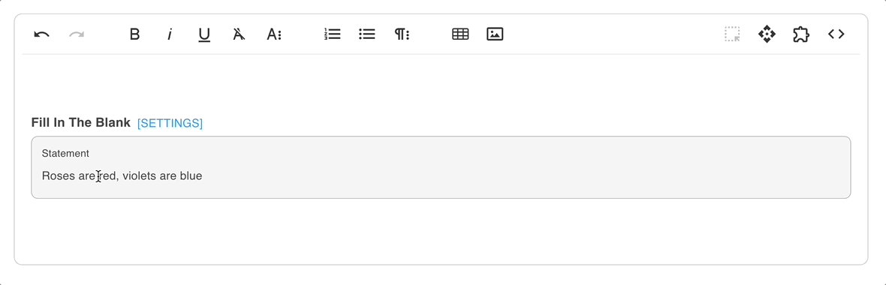
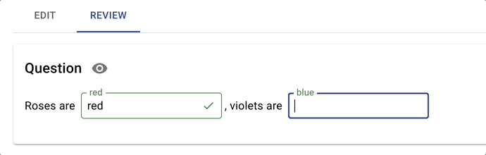

# Fill-in-the-blank

## Overview

A Fill-in-the-Blank Question requires students to enter words or numbers into one or more blank fields embedded within the question text. Unlike multiple-choice or matching formats, this type calls for exact (or closely matched) student input.

### Why Use It

This question type can test not just recall but also precision. It strengthens the neural connections to new knowledge by leveraging active retrieval.&#x20;

* Harder for AI-cheating systems to answer correctly.
* Encourages precision in terminology and spelling.
* Useful for testing comprehension, key formulas, or critical facts.
* Can easily adapt to various layouts, including sentences, paragraphs and tables.

### Use Cases

* **Data Interpretation:** Present a table and require students to fill in missing data points.
* **Cementing Connections**: Help students make connections between different concepts within the learning material.

## Create and Configure


EXAMIND is currently developing a new editor which will greatly enhance the capabilities with this question type. Until then, we highly suggest leveraging our support team to assist in the development of high-quality autograded questions that use fill-in-the-blank features.




### Add Fill-in-the-blank Block

<figure><figcaption></figcaption></figure>



### Write your Question Stem

<figure><figcaption></figcaption></figure>



### Select Text and Insert Blank

<figure><figcaption></figcaption></figure>



### Configure Settings


Remember to click **Update** to save your settings


<figure><figcaption></figcaption></figure>

**Acceptable Answers (1 per line):** Add correct answers here with each correct answer on a new line.


Use \{{moustache brackets\}} to add variables from the Dynamic Engine as acceptable answers or distractors


**Type:**

* **Text:** Used for text-based answers.
* **Number:** Used for number-based answers.
* **Dropdown:** Used for creating a dropdown selection.

**Text Options:**

* **Case Sensitive:** Check this to force answers to be case sensitive.
* **Error Tolerance (# of characters)**: Used to mitigate spelling mistakes.

**Number Options:**

* **Min. Decimals Required:** Specify the number of decimals in the answer.
* **Error Tolerance (%)**: Used to mitigate rounding errors in calculations.

**Dropdown Options:**

* **Distractors (1 per line):** Add distractors into your dropdown question.



### Review and Test Autograder

<figure><figcaption></figcaption></figure>

The review tab provides a real-time autograder to help you see how points are awarded.


We encourage you to review how points and error tolerance are treated with the autograder




## Instructor Tips

### Ensuring Academic Integrity

* **Dynamic Questions:** Use a combination of independent and dependent variables.
* **Limited Time Windows:** Give students a set amount of time to complete the question.
* **Variety of Answers:** For content that is easily guessable, consider using synonyms or less obvious blanks.

### Common Issues

* Students may have troubles spelling words. You can leverage error tolerance to catch spelling mistakes.
* If multiple correct answers are possible (e.g., “AR” vs. “Accounts Receivable”), include all acceptable variations.

### Best Practices

* Provide context so students know what form of answer you expect (a name, a number, a short phrase).
* For numerical answers, specify units or format (e.g., “Enter your answer as a whole number.”).
