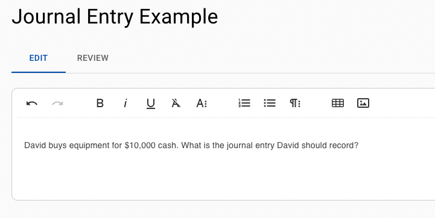
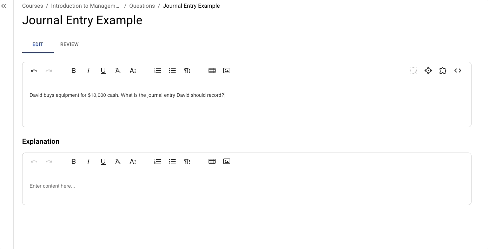
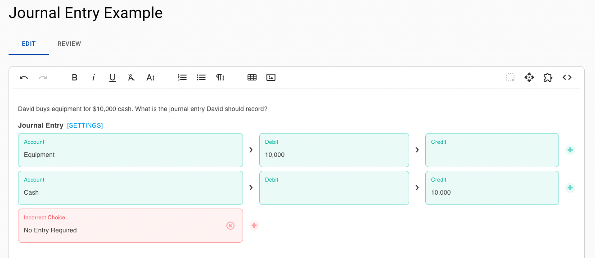
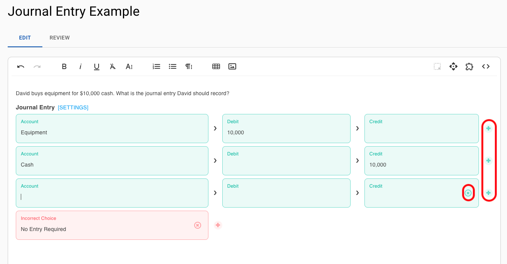
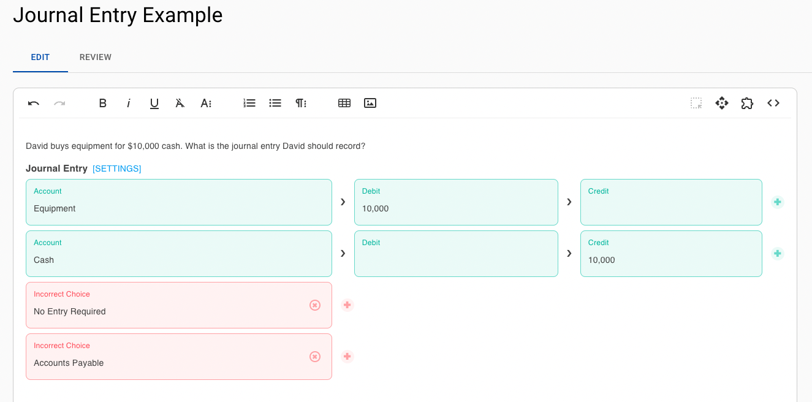
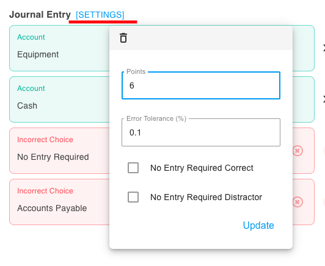
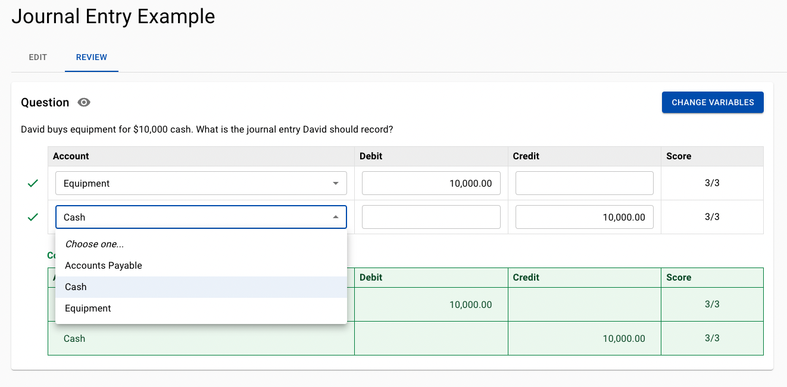

# Journal Entry

## Overview

A Journal Entry Question asks students to record accounting transactions in a general ledger format. The student is required to specify which accounts are debited, which are credited, and the corresponding amounts.

### Why Use It

This question type is effective for developing practical bookkeeping skills and reinforce their understanding of fundamental accounting principles. They encourage learners to think critically about how transactions affect the accounting equation (Assets = Liabilities + Equity) and ensure that they understand the rationale behind debits and credits.

* Encourages application of theoretical accounting principles to realistic scenarios.
* Reinforces accuracy, attention to detail, and logical reasoning in financial record-keeping.
* Prepares students for more advanced topics and professional accounting tasks.


EXAMIND provides full autograding with partial credit on Journal Entry questions.


### Use Cases

* **Introductory Accounting:** Practice classifying transactions into the correct accounts.
* **Intermediate/Advanced Accounting:** Apply accrued and deferred adjustments, recognize revenue/expenses, or record complex financial events.
* **Exam or Homework Assignments:** Assess students’ mastery of the double-entry accounting system.

## Create and Configure



### Write Your Question Stem

<figure><figcaption></figcaption></figure>



### Add Matching Block

<figure><figcaption></figcaption></figure>



### Add Accounts, Debits and Credits

<figure><figcaption></figcaption></figure>



### Add Line Items

Use the + and x symbols to add more correct and incorrect alternatives. EXAMIND will only show one correct choice at a time.

<figure><figcaption></figcaption></figure>



### Add Distractors

<figure><figcaption></figcaption></figure>


The list of accounts is presented alphabetically in a dropdown menu to students




### Configure Settings


Remember to click **Update** to save your settings


<figure><figcaption></figcaption></figure>

**Points:** The default total point value for this question in an assessment

**Error Tolerance (%)**: Enter the specified percentage of error tolerance that you will allow the auto grader to accept.

**No Entry Required Correct**: Check this box if "No Entry Required" is the correct answer. You will need to provide at least two distractor accounts if this box is checked.

**No Entry Required Distractor**: By default the "No Entry Required" will appear as a distractor. If you accidentally deleted it, simply check the "No Entry Required Distractor" checkbox and it will reappear.




### Review and Test Autograder

The review tab provides a real-time autograder to help you see how points are awarded.

<figure><figcaption></figcaption></figure>


We encourage you to review how points and error tolerance are treated with the autograder




## Autograder Behavior

This autograder is the culmination of 25+ accounting professors and a AAA board member collectively agreeing on an objective approach to grading journal entry questions.

Each line item in this question type is based on a 3 points system:

* 1 point for the correct account
* 1 point for the correct debit/credit
* 1 point for the correct amount


Partial points are only awarded if the student enters the correct account


### Examples

If the incorrect account is chosen, the student will receive a 0 out of 3 points for that given line item.

If the student enters the correct account and amount but wrong debit/credit, the student would receive 2 out of 3 points for that line item.

If the student enters the correct account but wrong amount and wrong position the student will receive 1 out of 3 points.

The total number of points (6) will be distributed across each line item. For example, if there are three line items worth a total of 6 points each line item will be worth a total of 6 points divided by 3 line items or 2 points each.

## Instructor Tips

### Ensuring Academic Integrity

* **Variations in Transactions:** Change the details or amounts for different student attempts.
* **Dynamic Questions:** Use a combination of independent and dependent variables.
* **Unique Scenarios:** Use a diverse set of transactions from multiple chapters or unit topics.
* **Limited Time Windows:** Give students a set amount of time to complete the question.

### Common Issues

* Students may reverse the debit and credit sides. Provide guidelines and reminders: “Debits on the left, Credits on the right.”
* Confusing Expense vs. Asset Accounts: Clarify which accounts represent assets acquired (e.g., supplies) versus expenses (e.g., when supplies are used).

### Best Practices

* Start with simple transactions and progress to more complex adjustments as the course advances.
* Encourage students to write down the accounting equation and think through the impact of each transaction before deciding on debits and credits.
