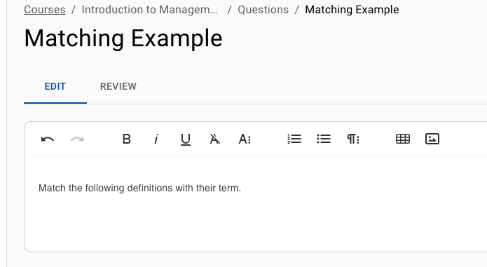
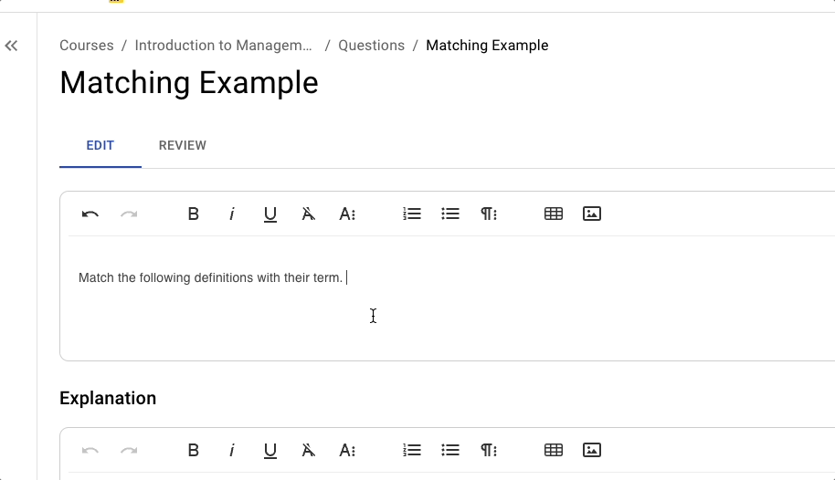
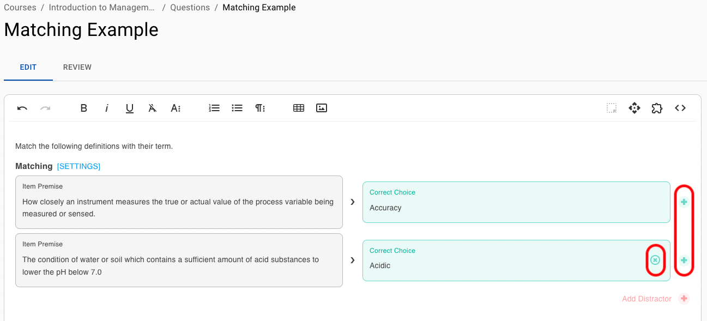
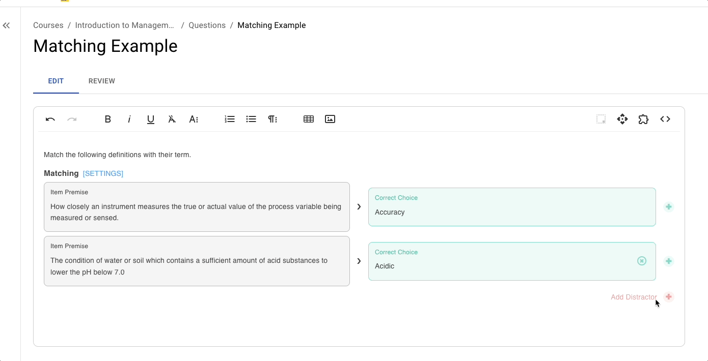
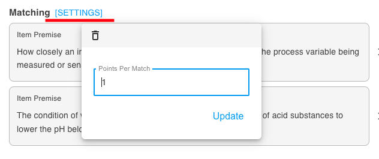

# Matching

## Overview

A Matching Question asks students to match each item premise (e.g., terms, dates, concepts) with the correct corresponding item from another list (e.g., definitions, events, explanations).

### Why Use It

This question type is effective for checking whether students can correctly associate key concepts with their definitions or theories with their applications. They are particularly efficient for reviewing material and ensuring foundational knowledge is solid before moving on to more complex tasks.

* Reinforces connections between concepts and their meanings.
* Helps students build more robust mental maps of course content.
* Provides a clear snapshot of which specific associations students understand and which might need further clarification.

### Use Cases

* **Terminology Quizzes:** Check if students can correctly pair academic terms with their definitions.
* **Conceptual Understanding:** Align theories with their appropriate applications or real-world examples.

## Create and Configure



### Write Your Question Stem

<figure><figcaption></figcaption></figure>



### Add Matching Block

<figure><figcaption></figcaption></figure>



### Input Item Premise and Correct Choice

<figure><figcaption></figcaption></figure>



### Add More Matches

Use the + and x symbols to add more correct and incorrect alternatives. EXAMIND will only show one correct choice at a time.

<figure><figcaption></figcaption></figure>



### Add Distractors

<figure><figcaption></figcaption></figure>



### Configure Settings

<figure><figcaption></figcaption></figure>

**Points:** The default total point value for this question in an assessment


Remember to click **Update** to save your settings




## Instructor Tips

### Ensuring Academic Integrity

* **Randomization:** Shuffle the order of answer options for each attempt.
* **Dynamic Questions:** Use a combination of independent and dependent variables.
* **Time Limits:** Set a time limit if desired to reduce the likelihood of external help.
* **Question Pools:** Draw from a bank of related questions to increase randomization.


EXAMIND automatically shuffles the order by default to support integrity


### Common Issues

* Students may struggle with ambiguous pairings. Ensure each prompt and its correct match have a clear, direct relationship.
* If many students fail a particular match, review whether that concept was adequately covered in class or course materials.

### Best Practices

* Use a consistent level of detail in prompts and matches.
* Include instructions in the prompt (“Select the best match from the dropdown to the right of each item.”) to ensure students understand the mechanism.
