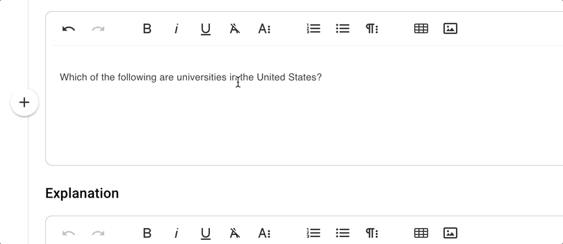
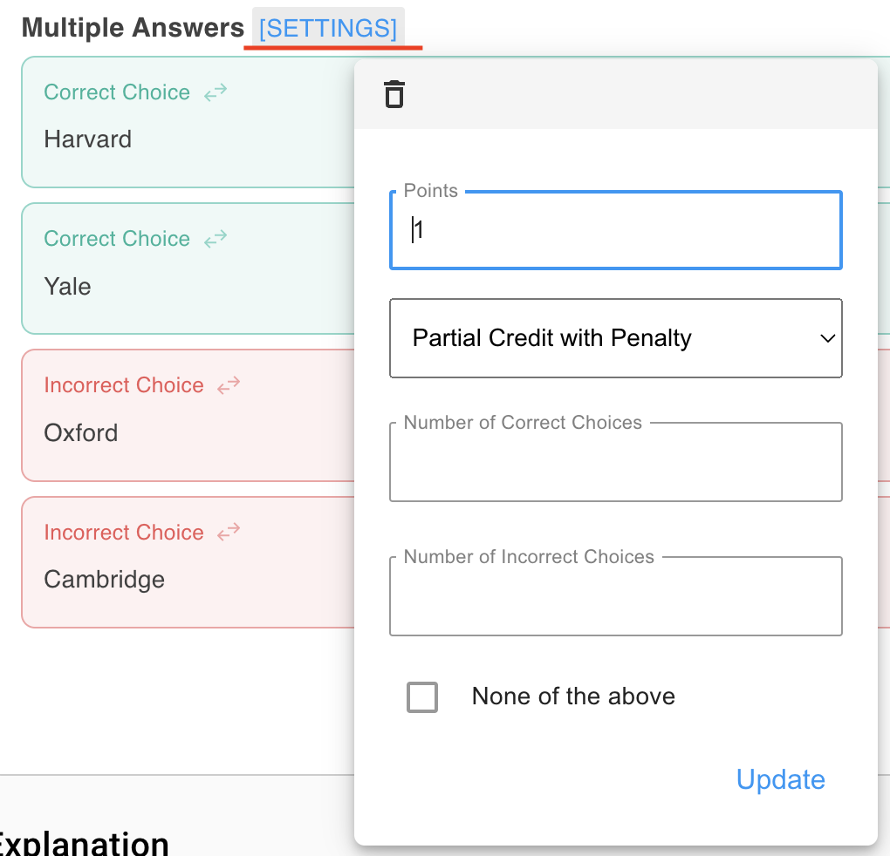

# Multiple Answer

## Overview

Multiple-answer questions present students with a single question followed by a set of possible answers, where more than one choice may be correct. Students must identify all correct options to earn full credit.

### Why Use It

This question type can assess more nuanced understanding than single-answer formats. They encourage students to consider a range of correct solutions or contributing factors, rather than focusing on a single “best” answer.

* Ideal for testing comprehensive knowledge of a topic.
* Encourages critical thinking by asking students to distinguish between multiple valid and invalid options.
* Useful for subjects that involve multiple correct approaches, solutions, or underlying principles.

### Use Cases

* **Complex Concepts:** Assess multifaceted topics where multiple conditions or criteria are correct.
* **Skill Application:** Evaluate the ability to recognize multiple techniques or methods applicable in a scenario.
* **Comparative Learning:** Distinguish between correct principles and subtle misconceptions.

## Create and Configure



### Write Your Question Stem

<figure><figcaption></figcaption></figure>



### Add Multiple Answer Block

<figure><figcaption></figcaption></figure>



### Input the Correct/Incorrect Answers

<figure><figcaption></figcaption></figure>



### Add Randomization

Use the + and x symbols to add more correct and incorrect alternatives. EXAMIND , by default, will show the number of correct and incorrect choices listed. To add randomization proceed to Step 5 and update the number of correct and incorrect choices to present to the student. &#x20;

<figure><figcaption></figcaption></figure>



### Configure Settings


Remember to click **Update** to save your settings.


<figure><figcaption></figcaption></figure>

The settings for multiple-answer questions include:&#x20;

**Points:** The total point value for this question in an assessment.

**Scoring:**

* **Partial Credit with Penalty:** Each correct selection adds and each incorrect selection subtracts, resulting in partial points awarded for partially correct answers.
* **Exact Match:** Only an exact match of all correct choices and no incorrect choices will award full points.

**Number of Correct Choices:** The number of correct choices to display. Leaving this empty will display all correct choices as options.

**Number of Incorrect Choices:** The number of incorrect choices to display. Leaving this empty will display all incorrect choices as options.

**None of the above:** Add a "none of the above" answer choice to the bottom of each question and EXAMIND will randomly serve this as a correct answer choice.



## Instructor Tips

### Ensuring Academic Integrity

* **Randomization:** Shuffle answer choices for each student attempt.
* **Dynamic Questions:** Use a combination of independent and dependent variables.
* **Time Limits:** Set a time limit to reduce the likelihood of external help.
* **Question Pools:** Draw from a bank of related questions to increase randomization.


EXAMIND automatically shuffles answer choices by default to support integrity.


### Common Issues

* Students may be unclear that multiple answers can be correct. Include a clear instruction like “Select all that apply.”
* If a significant percentage of students select a specific incorrect option, it may indicate confusion or a gap in instruction.

### Best Practices

* Balance the number of correct and incorrect options so the question is neither too obvious nor too confusing.
* Use student performance analytics to refine questions for future courses.
