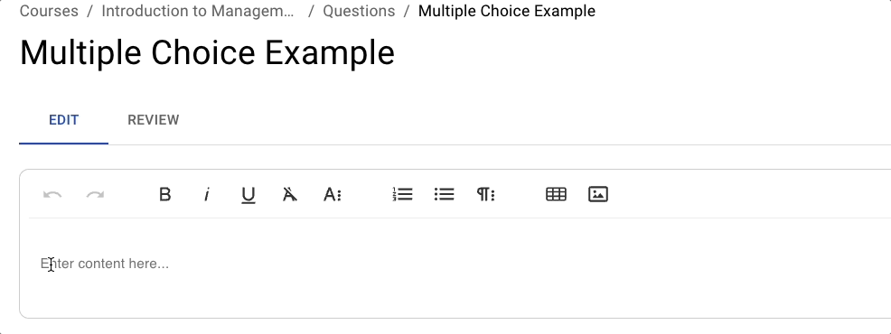
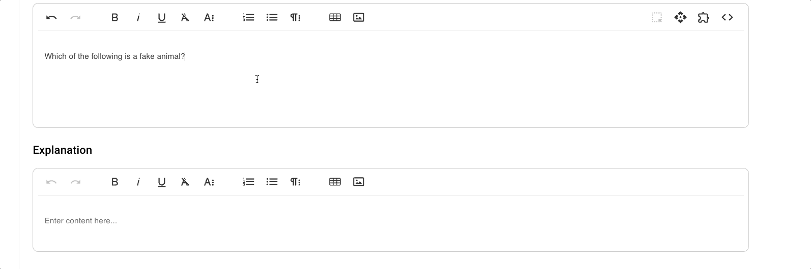
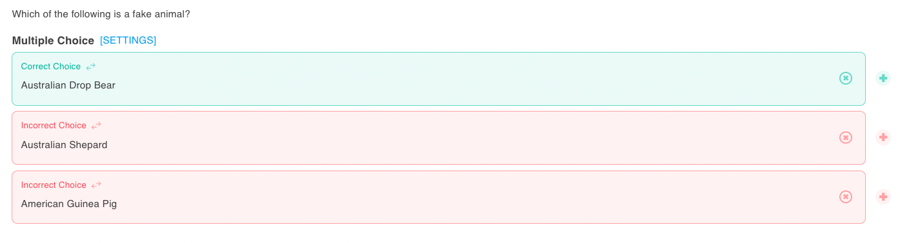
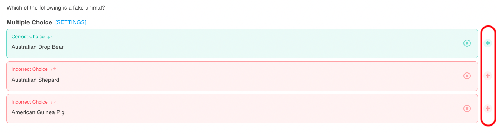
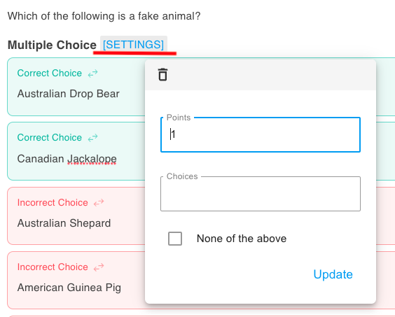

# Multiple Choice

## Overview

A Multiple Choice Question presents students with a single question followed by a set of possible answers. Students must select the one best answer from the provided options.

The key to a good multiple choice question lies in creating really good distractors.

### Why Use It

This question type is tool suitable for quickly gauging students’ factual knowledge, conceptual understanding, or the application of theories. They can be automatically graded, making them efficient for both high-enrollment lecture courses and smaller seminar-style classes.

* Reinforces key terminology, concepts, or principles in a low-stakes quiz setting.
* Offers immediate feedback to help students identify gaps in their knowledge.
* Well-designed distractors can encourage critical thinking by challenging common misconceptions.

### Use Cases

* **Knowledge Checks:** Test foundational understanding of course material before deeper discussions.
* **Reading Quizzes:** Ensure students complete and comprehend assigned readings.
* **Exam Questions:** Provide a fair and standardized means of assessing a wide range of course content.

## Create and Configure



### Write Your Question Stem

<figure><figcaption></figcaption></figure>



### Add Multiple Choice Block

<figure><figcaption></figcaption></figure>



### Input the Correct/Incorrect Answers

<figure><figcaption></figcaption></figure>



### Add Randomization

Use the + and x symbols to add more correct and incorrect alternatives. EXAMIND will only show one correct choice at a time.

<figure><figcaption></figcaption></figure>



### Configure Settings

<figure><figcaption></figcaption></figure>

**Points:** The default point value for this question in an assessment

**Choices:** The total number of choices to display (ex. 4 would show choices A-D). Useful for increasing randomization

**None of the above:** Add a "none of the above" answer choice to the bottom of each question and EXAMIND will randomly serve this as a correct answer choice.


Remember to click **Update** to save your settings




## Instructor Tips

### Ensuring Academic Integrity

* **Randomization:** Shuffle answer choices for each student attempt.
* **Dynamic Questions:** Use a combination of independent and dependent variables.
* **Time Limits:** Set a time limit if desired to reduce the likelihood of external help.
* **Question Pools:** Draw from a bank of related questions to increase randomization.


EXAMIND automatically shuffles answer choices by default to support integrity


### Common Issues

* **Overly Vague Question Stems:** Make sure the question stem clearly indicates the context.
* **Unclear Distractors:** If too similar, consider adjusting wording for clarity.

### Best Practices

* Run a quick pilot with a colleague or teaching assistant to ensure clarity.
* Review student results post-quiz. If many students choose a certain distractor, it might be misleading or identify a gap in instruction.
