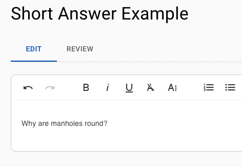
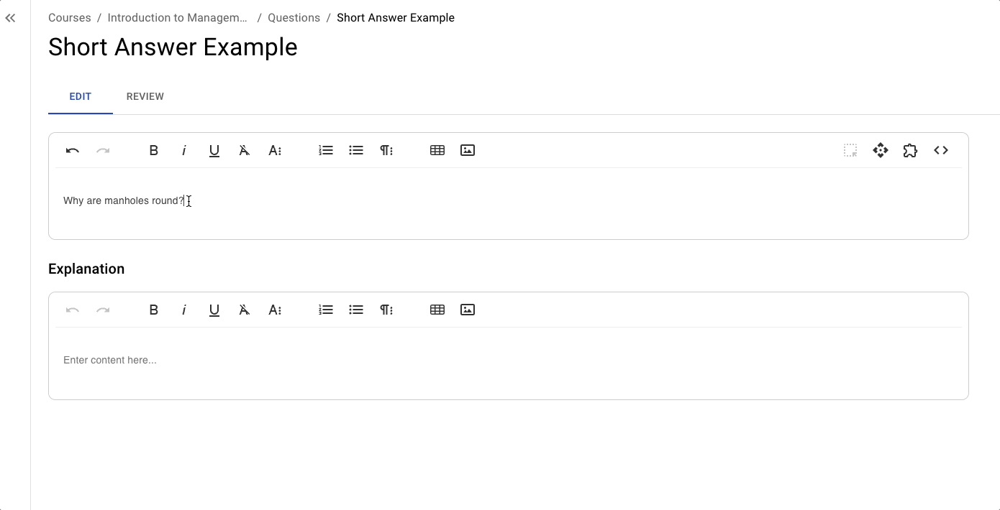
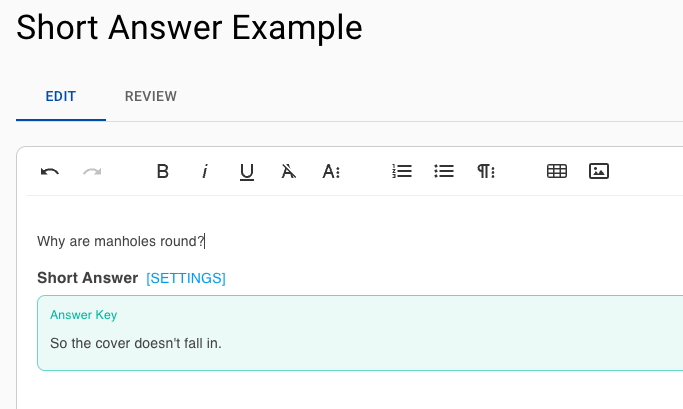
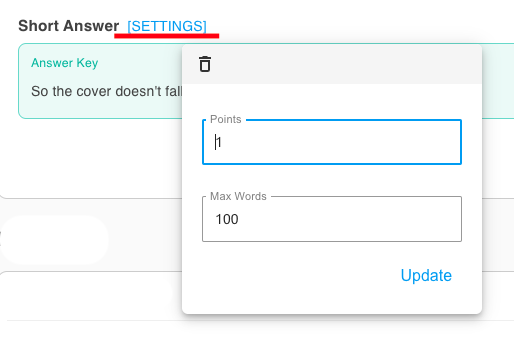

# Short Answer

## Overview

Short answer (Paragraph Response) questions prompt students to write one or more paragraphs in response to a prompt. Unlike fill-in-the-blank or multiple-choice formats, this question type requires higher-order thinking, organization of ideas, and coherent expression.

### Why Use It

This question type is ideal when you want students to apply, analyze, or synthesize knowledge rather than just recall facts. They encourage critical thinking, allow for nuanced understanding, and let students demonstrate their reasoning processes or interpret course materials in their own words.

* Encourages deeper engagement with course content.
* Provides insight into students’ reasoning, interpretation, and application skills.
* Allows flexibility in responses, accommodating a range of acceptable answers.

### Use Cases

* **Critical Thinking Exercises:** Have students defend a position, analyze a scenario, or interpret data.
* **Reading Reflections:** Ask students to summarize and reflect on a key concept from assigned readings.
* **Applied Problem-Solving:** Have students explain how they would address a real-world situation or case study.

## Create and Configure



### Write Your Question Stem

<figure><figcaption></figcaption></figure>



### Add Short Answer Block

<figure><figcaption></figcaption></figure>



### Input Correct Answer

<figure><figcaption></figcaption></figure>


Short answer autograding is available in closed beta. Contact [**support@examind.io**](mailto:support@examind.io) for more information.




### Configure Settings


Remember to click **Update** to save your settings.


<figure><figcaption></figcaption></figure>

**Points:** The point value for this question in an assessment.

**Max Words:** The word count limit for the question.


Students are warned when they go over the word count and will be unable to type further at 2x the word limit.


<figure><figcaption>
Example of a student response going over the word limit
</figcaption></figure>




## Instructor Tips

### Ensuring Academic Integrity

* **Unique Scenarios:** Use unique characters and vary the scenarios to reduce plagiarism.
* **Limited Time Windows:** Give students a set amount of time to complete the question.

### Common Issues

* Students might write excessively long responses if guidelines aren’t provided. Specify a word limit.
* Students may provide overly vague or unfocused responses. Encourage specificity and reference to course concepts.

### Best Practices

* Provide a rubric or set of criteria ahead of time so students know what aspects you value (e.g., accuracy, detail, coherence).
* After grading, offer general class feedback addressing common strengths and weaknesses.
