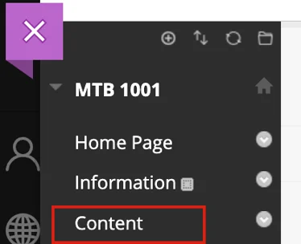

# Assessment Deeplink

## Blackboard

The steps to deep link to an EXAMIND assessment will differ depending on whether you're using Blackboard Classic or Blackboard Ultra.

### Blackboard Ultra

Go to a course and locate the Course Content section in the middle of the page. Click on the plus icon to add content and then select Content Market from the options available.

<figure><figcaption></figcaption></figure>

In the Content Market, Institution Tools will be located in the lower pane. Find the tool labelled Assessment. This will open the EXAMIND LTI Tool.

<figure><figcaption></figcaption></figure>

Create a new course in Examind with matching criteria to the current course.

<figure><figcaption></figcaption></figure>

### Blackboard Classic

Navigate to a course, and select Content in the left hand tab.

<figure><figcaption></figcaption></figure>

Select Build Content > Assessment. This will open the EXAMIND LTI.

<figure><figcaption></figcaption></figure>

Create a new course in EXAMIND with matching criteria to the current course.

<figure><figcaption></figcaption></figure>

## Brightspace

\[INSERT]

## Canvas

\[INSERT]

## Moodle

\[INSERT]
