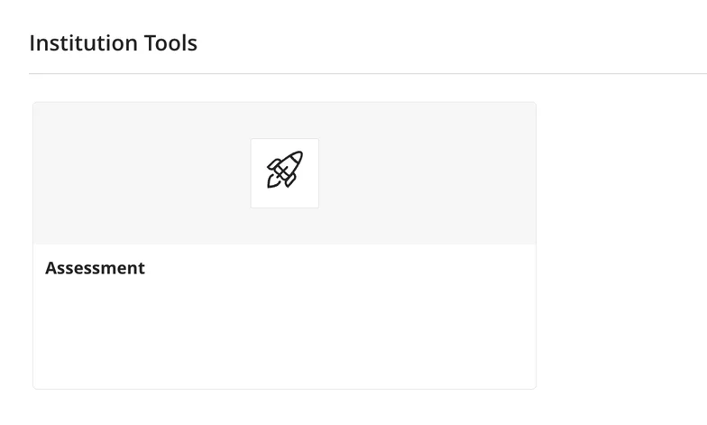
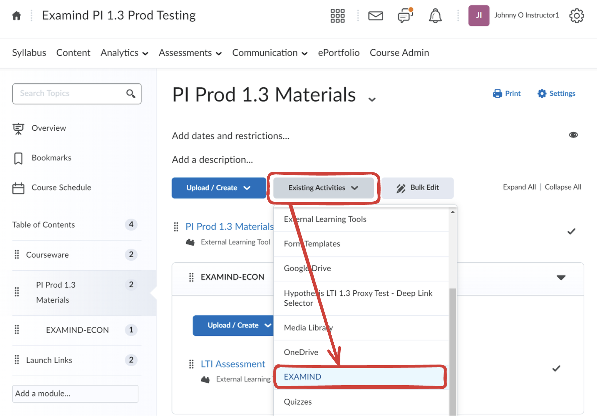

# Assessment Deeplink

## Blackboard

The steps to deep link to an EXAMIND assessment will differ depending on whether you're using Blackboard Classic or Blackboard Ultra.

### Blackboard Ultra

Go to a course and locate the Course Content section in the middle of the page. Click on the plus icon to add content and then select Content Market from the options available.

<figure><figcaption></figcaption></figure>

In the Content Market, Institution Tools will be located in the lower pane. Find the tool labelled Assessment. This will open the EXAMIND LTI Tool.

<figure><figcaption></figcaption></figure>

Create a new course in Examind with matching criteria to the current course.

<figure><figcaption></figcaption></figure>

### Blackboard Classic

Navigate to a course, and select Content in the left hand tab.

<figure><figcaption></figcaption></figure>

Select Build Content > Assessment. This will open the EXAMIND LTI.

<figure><figcaption></figcaption></figure>

Create a new course in EXAMIND with matching criteria to the current course.

<figure><figcaption></figcaption></figure>

## Brightspace

Go to a course in Brightspace, then select **Existing Activities**, then **EXAMIND** (or a different name selected during **LTI Tool Installation**):

<figure><figcaption></figcaption></figure>

If this is your first time adding an assessment into this Brightspace course, you'll be asked to select an EXAMIND course to link this course to.

Either select an existing course in EXAMIND or create a new one:

<figure><figcaption></figcaption></figure>

If you've already linked an EXAMIND course, you'll be asked to select an assessment in EXAMIND. Either select an existing assessment or create a new one:

<figure><figcaption></figcaption></figure>

If you select the New Assessment option, by default it will be named **LTI Assessment**. Rename it in Brightspace:

<figure><figcaption></figcaption></figure>

Open the activity, click Edit, and rename it in EXAMIND:

<figure><figcaption></figcaption></figure>

EXAMIND's assessment is now available as an activity in Brightspace.

## Canvas

Create a new assignment in Canvas. Give it an **Assignment name**, then set the number of **Points**:

<figure><figcaption></figcaption></figure>

Set **Submission Type** to **External Tool**, then click **Find**:

<figure><figcaption></figcaption></figure>

Select the EXAMIND LTI Tool:

<figure><figcaption></figcaption></figure>

If this is the first time you're setting up and EXAMIND assignment for this Canvas course, you will be asked to create a matching course in EXAMIND. Check that the information is correct before proceeding. Pay particular attention to start date and end date, as they should match the start and end dates in Canvas.

<figure><figcaption></figcaption></figure>

Check **Load This Tool In A New Tab** and leave **Allowed Attempts** as **Unlimited** even if you don't intend to allow more than one attempt. The allowed attempt will be controlled in EXAMIND's UI later. Optionally assign **Due** date. If you leave **Due** date blank for now, be sure to set it later. Leave **Available from** and **Until** blank for now. We will come back to it later.

<figure><figcaption></figcaption></figure>

**Save** the assignment.

## Moodle

\[INSERT]
