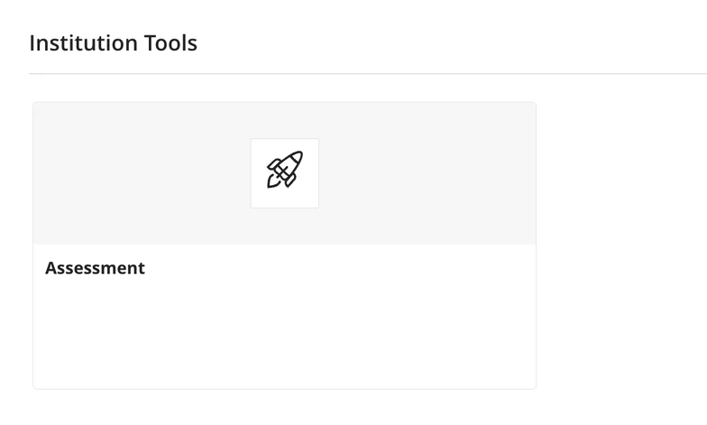
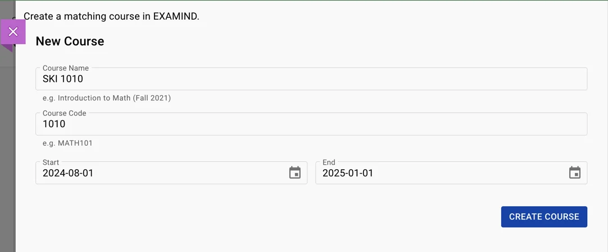
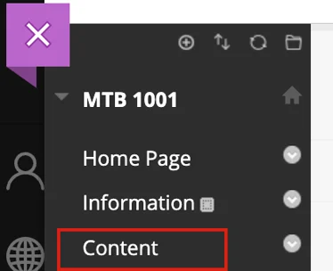
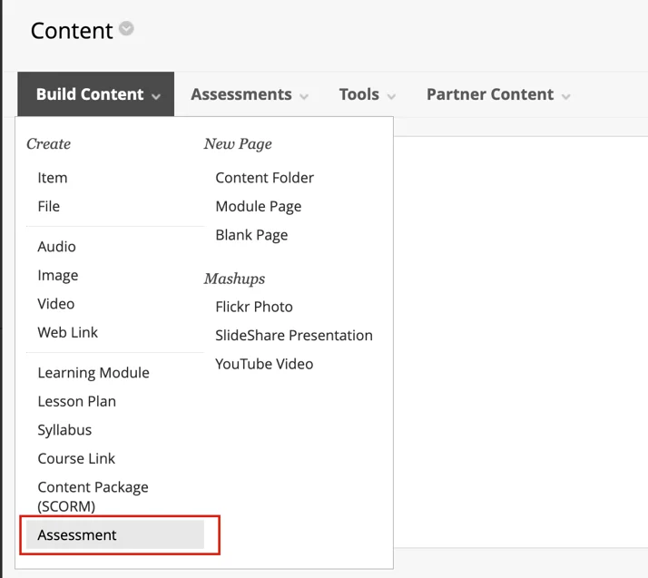

# Blackboard

## Blackboard Ultra

From the Course Content section, click the **+** icon to add content and select Content Market.

<figure><figcaption></figcaption></figure>

Locate Institutional Tools and click the **Assessment** card to launch the EXAMIND LTI Tool.

<figure><figcaption></figcaption></figure>

Complete the fields to match your Blackboard settings and click **Create Course.**

<figure><figcaption></figcaption></figure>

## Blackboard Classic

From the Course page, click **Content** in the left hand tab.

<figure><figcaption></figcaption></figure>

Select **Build Content** > **Assessment** to launch EXAMIND LTI tool.

<figure><figcaption></figcaption></figure>

Complete the fields to match your Blackboard settings and click **Create Course.**

<figure><figcaption></figcaption></figure>

## Special Considerations


Students extensions need to be configured in both Blackboard and EXAMIND. Refer to the [scheduling page](../../../deliver/schedule.md) on how to configure extensions in EXAMIND.

