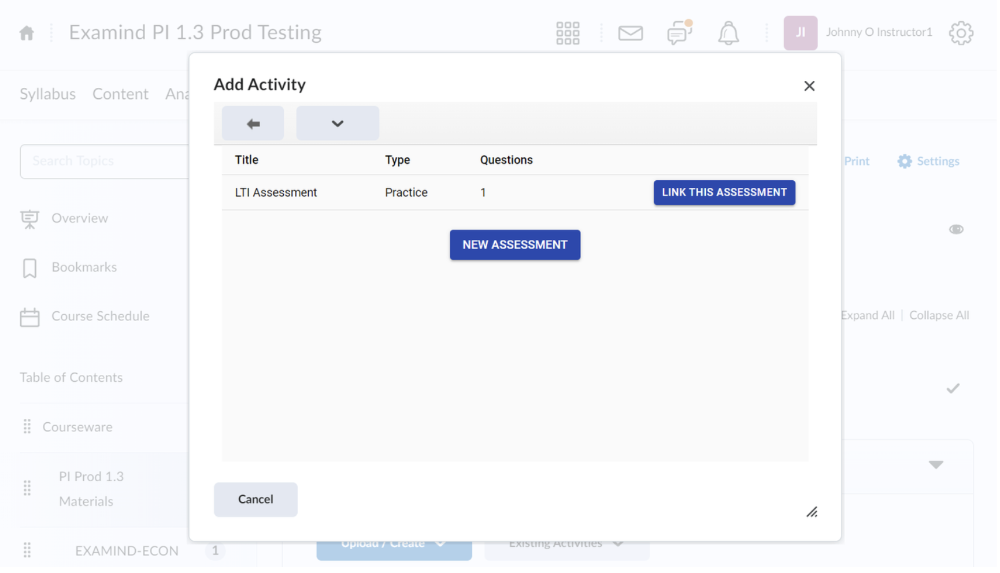

# Brightspace

Go to a course in Brightspace, then select **Existing Activities**, then **EXAMIND** (or a different name selected during **LTI Tool Installation**):

<figure><figcaption></figcaption></figure>

If this is your first time adding an assessment into this Brightspace course, you'll be asked to select an EXAMIND course to link this course to.

Either select an existing course in EXAMIND or create a new one:

<figure><figcaption></figcaption></figure>

If you've already linked an EXAMIND course, you'll be asked to select an assessment in EXAMIND. Either select an existing assessment or create a new one:

<figure><figcaption></figcaption></figure>

If you select the New Assessment option, by default it will be named **LTI Assessment**. Rename it in Brightspace:

<figure><figcaption></figcaption></figure>

Open the activity, click Edit, and rename it in EXAMIND:

<figure><figcaption></figcaption></figure>

EXAMIND's assessment is now available as an activity in Brightspace.


Students extensions needs to be configured in both Brightspace and EXAMIND. Refer to the [scheduling page](../../../deliver/schedule.md) on how to configure extensions in EXAMIND.

