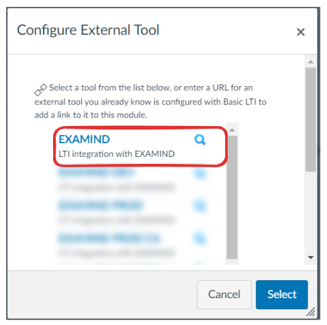

# Canvas

Create a new assignment in Canvas. Give it an **Assignment name**, then set the number of **Points**:

<figure><figcaption></figcaption></figure>

Set **Submission Type** to **External Tool**, then click **Find**:

<figure><figcaption></figcaption></figure>

Select the EXAMIND LTI Tool:

<figure><figcaption></figcaption></figure>

If this is the first time you're setting up and EXAMIND assignment for this Canvas course, you will be asked to create a matching course in EXAMIND. Check that the information is correct before proceeding. Pay particular attention to start date and end date, as they should match the start and end dates in Canvas.

<figure><figcaption></figcaption></figure>

Check **Load This Tool In A New Tab** and leave **Allowed Attempts** as **Unlimited** even if you don't intend to allow more than one attempt. The allowed attempt will be controlled in EXAMIND's UI later. Optionally assign **Due** date. If you leave **Due** date blank for now, be sure to set it later. Leave **Available from** and **Until** blank for now. We will come back to it later.

<figure><figcaption></figcaption></figure>

**Save** the assignment.


Students extensions needs to be configured in both Canvas and EXAMIND. Refer to the [scheduling page](../../../deliver/schedule.md) on how to configure extensions in EXAMIND.

