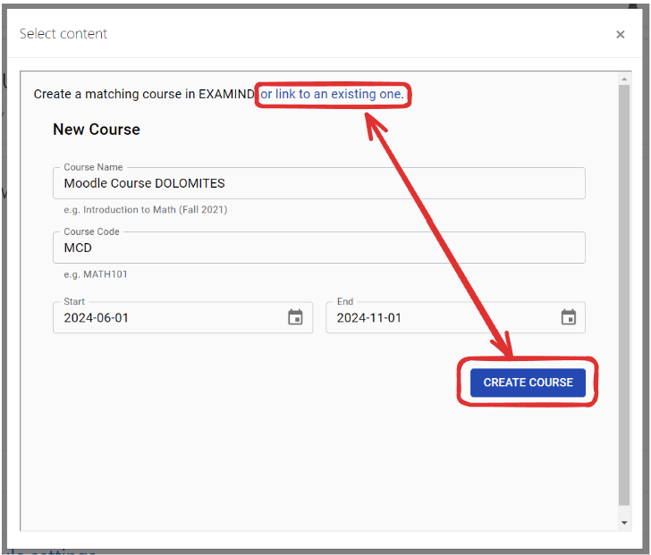
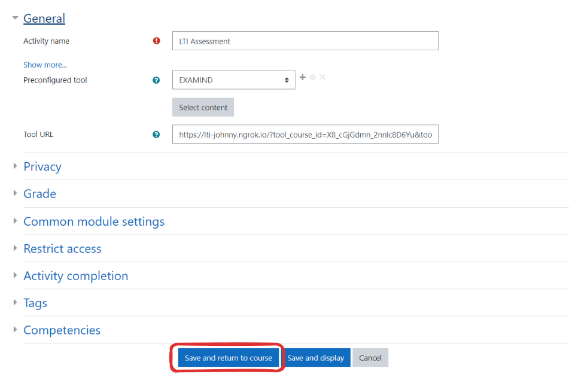

# Moodle

Go to a course in Moodle, then click the **Turn editing on** button.

<figure><figcaption></figcaption></figure>

Click **+ Add an activity or resource** on any topic (Topic 5 in the example below).

<figure><figcaption></figcaption></figure>

Click **External Tool.**

<figure><figcaption></figcaption></figure>

Leave **Activity name** blank for now; it will auto-populate. Choose **EXAMIND** from the **Preconfigured tool** dropdown, then click the **Select Content** button.

<figure><figcaption></figcaption></figure>


If this is the first time you launch LTI Connect for EXAMIND, you may encounter this error message. An automatic notification will have already been sent to EXAMIND's support team to take action. If this happens during regular business hours, we will resolve this issue within a couple of hours and notify you by email when this is done.

You may also wish to contact us at [**support@examind.io**](mailto:support@examind.io) at this time.


<figure><figcaption></figcaption></figure>

Once your platform is activated, try again.

<figure><figcaption></figcaption></figure>

Create a new linked course in EXAMIND or select an existing course that you'd like to link.

<figure><figcaption></figcaption></figure>

Select the assessment and click **Link This Assessment** that you'd like to link.

<figure><figcaption></figcaption></figure>

Click the **Save and return to course** button.

<figure><figcaption></figcaption></figure>

EXAMIND's LTI is now available as an activity in Moodle.

## Special Considerations


Students extensions needs to be configured in both Moodle and EXAMIND. Refer to the [scheduling page](../../../deliver/schedule.md) on how to configure extensions in EXAMIND.

