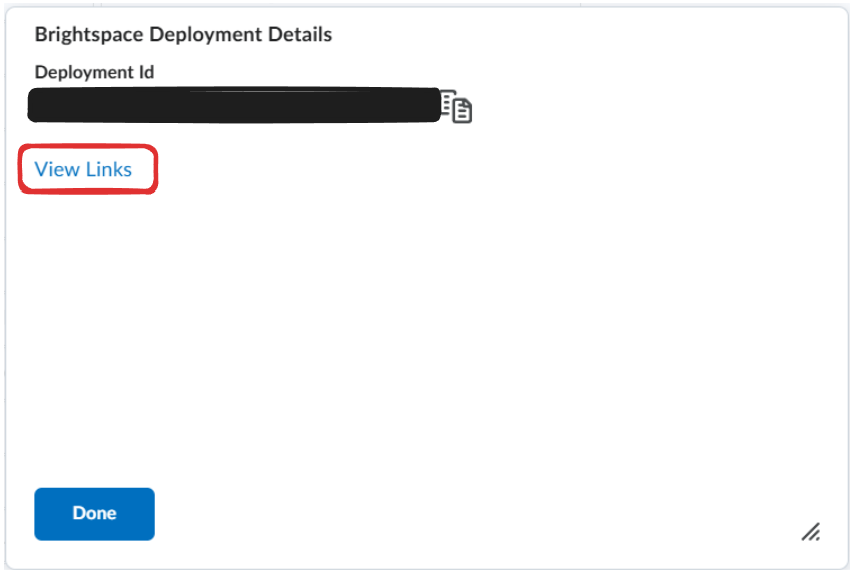

# Self Review

### Accessing Self Review

Follow these steps to access Self Review:

1. Navigate to the assessment tab by clicking on Assessments within your course
2. Select the desired assessment
3. From the left-hand menu, select **Self Review**

### Add Availability Windows

Select **+ ADD AVAILABILITY** and enter the availability window for self review with start and end dates. The availability window can be set for everyone, by student, or by section.


To create additional availability windows select the "+ New" tab.&#x20;


### Configure Review Settings&#x20;

Self Review has two options:

1. Answer Key
2. Answer Explanation


By toggling on and off each option you can preview how each option appears to students in the Example Preview o your Settings.&#x20;


**Answer Key**: By default, when Answer Key is toggled off, the student will only see the correct answer. When Answer Key is toggled on, the student will see the answer they selected and the correct answer choice.

**Answer Explanation**: By default, the Answer Explanation is turned off. If the Answer Explanation is toggled on the student will be given the information that is included in the explanation text box located in the question builder:

<figure><figcaption></figcaption></figure>

