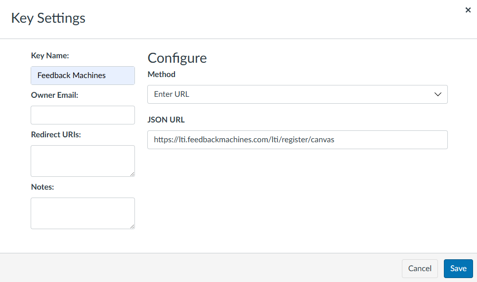
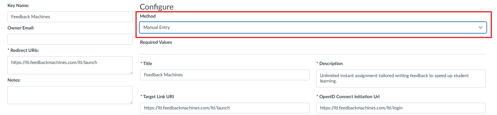
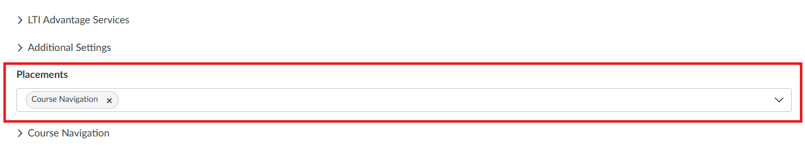
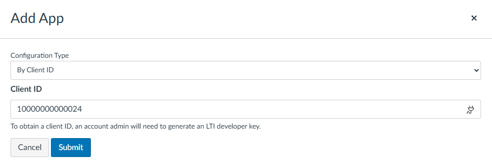
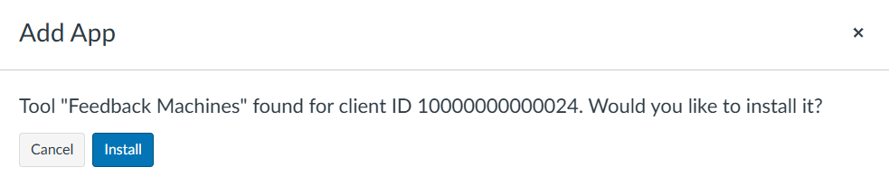

# Feedback Machines: Canvas LTI Installation

This guide is for **institution IT or Canvas administrators**. It covers the one-time installation of the Feedback Machines LTI tool at the Canvas account level. Once it's installed, instructors can [enable Feedback Machines in their own courses](../feedback-machines/canvas-setup.md).


Feedback Machines is a **separate product** from the EXAMIND Platform and has its **own** Canvas LTI integration. Installing one does not install the other.


## Install the LTI tool



### Create an LTI developer key

In Canvas, go to **Admin → Developer Keys** and select **+ LTI Key**.

* **Key Name:** `Feedback Machines`
* **Method:** `Enter URL`
* **JSON / Configuration URL:** `https://lti.feedbackmachines.com/lti/register/canvas`

<figure><figcaption></figcaption></figure>

<figure><figcaption></figcaption></figure>



### Set the placement

Edit the key and, under **Manual Entry**, set the placement to **Course Navigation**. Save.

<figure><figcaption></figcaption></figure>

<figure><figcaption></figcaption></figure>

<figure><figcaption></figcaption></figure>



### Turn the key ON

New developer keys default to **OFF**. Switch the Feedback Machines key state to **ON**.

<figure><figcaption></figcaption></figure>



### Install the app by Client ID

Copy the **Client ID** shown for the developer key. Then go to **Settings → Apps**, click **+ App**, choose **By Client ID** as the configuration type, paste the Client ID, and confirm the installation.

<figure><figcaption></figcaption></figure>

<figure><figcaption></figcaption></figure>

<figure><figcaption></figcaption></figure>

<figure><figcaption></figcaption></figure>



### Send your registration details to EXAMIND

So we can finish the integration on our side, email the following to [support@examind.io](mailto:support@examind.io):

* Your **production** Canvas instance URL
* Your **test** Canvas instance URL (if you have one)
* Whether your Canvas is **self-hosted** or on **Instructure Cloud**
* The **Client ID** generated above

We'll complete the platform registration and confirm when it's ready to test.



## Next step

Once installation is confirmed, instructors can [enable Feedback Machines in their course and link a class](../feedback-machines/canvas-setup.md).
