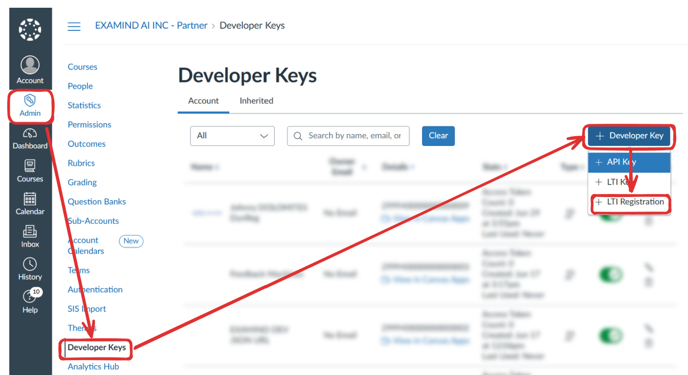
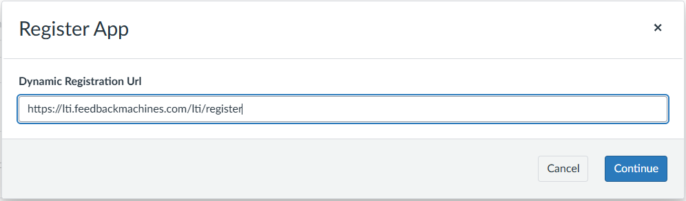
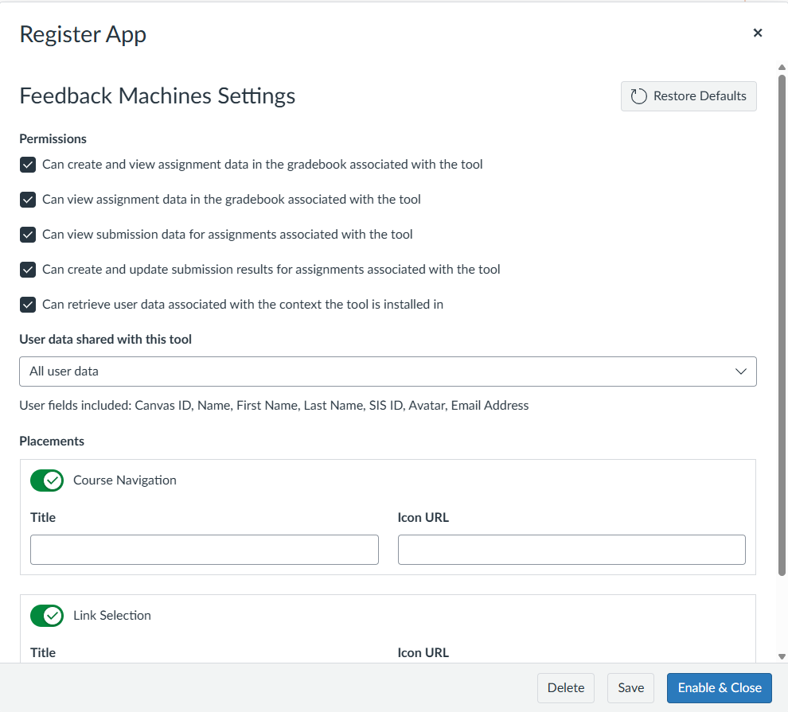
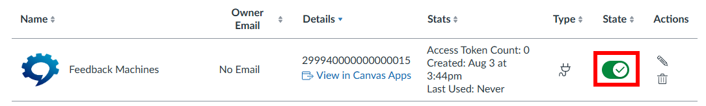
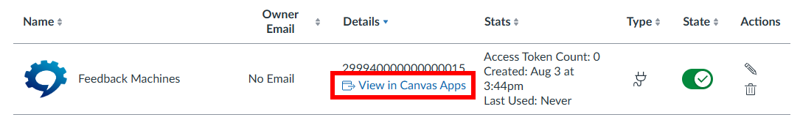
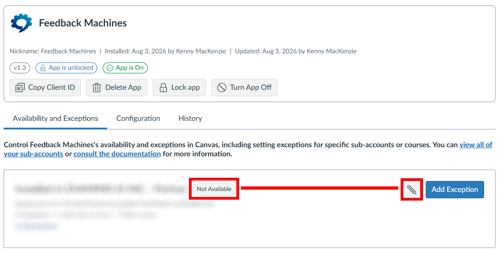
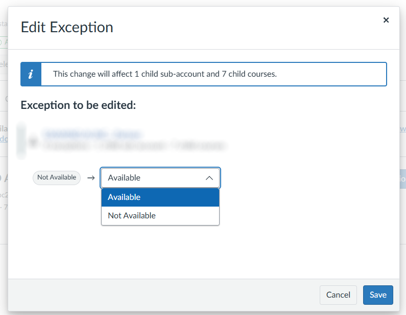
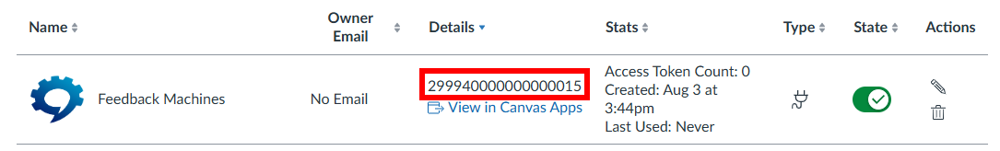

# Feedback Machines: Canvas LTI Installation

This guide is for **institution IT or Canvas administrators**. It covers the one-time installation of the Feedback Machines LTI tool at the Canvas account level. Once it's installed, instructors can [enable Feedback Machines in their own courses](../feedback-machines/using-canvas.md).


Feedback Machines is a **separate product** from the EXAMIND Platform and has its **own** Canvas LTI integration. Installing one does not install the other.


Feedback Machines supports two ways to install its LTI tool in Canvas. **Dynamic Registration is the recommended method** — it configures the developer key, placements, and branding automatically from a single URL. A manual **JSON URL** method is available as a fallback (see [Alternative: install with a JSON URL](#alternative-install-with-a-json-url)).

## Install via Dynamic Registration



### Register Feedback Machines

In Canvas, go to **Admin → Developer Keys**, click **+ Developer Key**, and select **+ LTI Registration**:

<figure><figcaption></figcaption></figure>

Enter the **Dynamic Registration URL**, then click **Continue**:

```
https://lti.feedbackmachines.com/lti/register
```

<figure><figcaption></figcaption></figure>



### Review the settings and enable

Canvas and Feedback Machines exchange the configuration automatically — the app name, logo, permissions, and placements are filled in for you. Review them, then click **Enable & Close**:

<figure><figcaption></figcaption></figure>



### Check the developer key is ON

Back on the **Developer Keys** page, confirm the new **Feedback Machines** key's state is **ON**:

<figure><figcaption></figcaption></figure>



### Open the app in Canvas Apps

On the same row, click **View in Canvas Apps**:

<figure><figcaption></figcaption></figure>



### Make the app Available where you want it

On the **Availability and Exceptions** tab, the app starts as **Not Available**. Make it **Available** wherever you want instructors to see it: across the whole account, or only in the specific course(s), department(s), or schools adopting Feedback Machines — use **Add Exception** to scope it to a course or sub-account.

For example, to make it available account-wide, click the pencil icon next to the account row:

<figure><figcaption></figcaption></figure>

Change **Not Available** to **Available**, then **Save**:

<figure><figcaption></figcaption></figure>


This step is easy to miss: the app can show **"App is On"** and still be invisible in courses. Until availability is set to **Available**, the Feedback Machines link won't appear in any course navigation.




### Send your details to EXAMIND

We connect your Canvas instance to your institution's license on our side. Copy the **Client ID** from the **Details** column of the **Developer Keys** page:

<figure><figcaption></figcaption></figure>

Then email the following to [support@examind.io](mailto:support@examind.io):

* Your **production** Canvas instance URL
* Your **test** Canvas instance URL (if you have one)
* The **Client ID** copied above

We'll confirm when everything is connected.



### Verify

In a Canvas course, enable **Feedback Machines** in the course navigation (**Settings → Navigation**) and click the link — it should launch. This is the same per-course activation [instructors do themselves](../feedback-machines/using-canvas.md).



## Alternative: install with a JSON URL

If Dynamic Registration isn't available on your Canvas instance, you can install manually. Unlike Dynamic Registration, this method doesn't set the course-navigation placement or register your Canvas instance with us automatically, so it has a few more steps.



### Create an LTI developer key

In Canvas, go to **Admin → Developer Keys**, click **+ Developer Key**, and select **+ LTI Key**.

* **Key Name:** `Feedback Machines`
* **Method:** `Enter URL`
* **JSON / Configuration URL:** `https://lti.feedbackmachines.com/lti/register/canvas`

Click **Save**.



### Set the placement

Edit the key and, under **Manual Entry**, set the placement to **Course Navigation**. Save.



### Turn the key ON

New developer keys default to **OFF**. Switch the Feedback Machines key state to **ON**.



### Send your registration details to EXAMIND

Copy the **Client ID** shown for the developer key (the number in the **Details** column). Then email the following to [support@examind.io](mailto:support@examind.io):

* Your **production** Canvas instance URL
* Your **test** Canvas instance URL (if you have one)
* Whether your Canvas is **self-hosted** or on **Instructure Cloud**
* The **Client ID** copied above

We'll register your Canvas instance on our side and confirm by email. Until that registration is complete, the Feedback Machines link won't launch for instructors or students.



### Install the app by Client ID

Go to **Settings → Apps** and click **View App Configurations**. Click **+ App**, choose **By Client ID** as the configuration type, paste the Client ID, click **Submit**, and confirm the installation.


On Instructure Cloud, a newly installed app can be **blocked by default**. If Canvas reports *"This app has been blocked by your administrator"* when you click **Install**, unblock the Feedback Machines app in your account's app settings, or [contact us](mailto:support@examind.io) for help.




## Next step

Once installation is confirmed, instructors can [enable Feedback Machines in their course and link a class](../feedback-machines/using-canvas.md).
