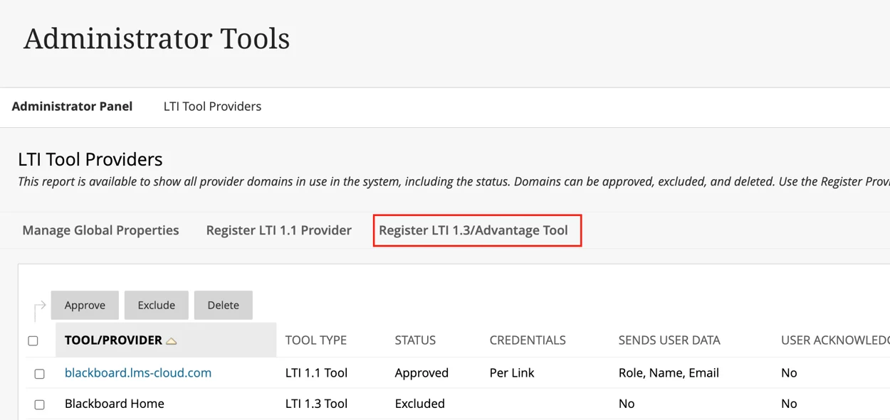

# Blackboard

The following set of instructions apply for both Blackboard Classic and Blackboard Ultra.

## Step 1:  Register EXAMIND LTI Tool with Blackboard

Log in with your administrator account and go to the Blackboard Administrator Panel. Go to ADMIN-> LTI Tool Providers.

Click Register LTI 1.3/Advantage Tool.

<figure><figcaption></figcaption></figure>

