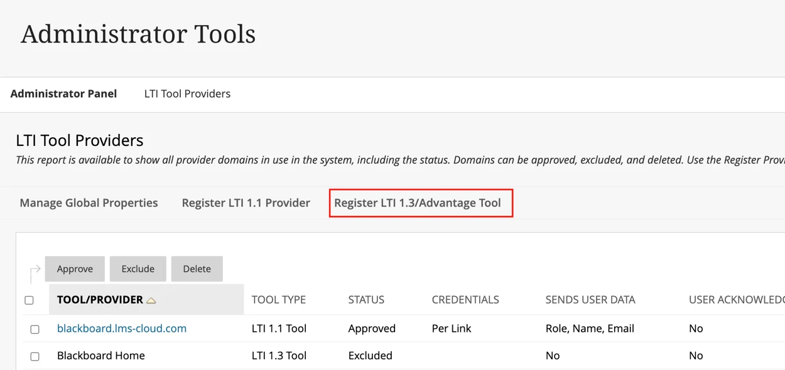
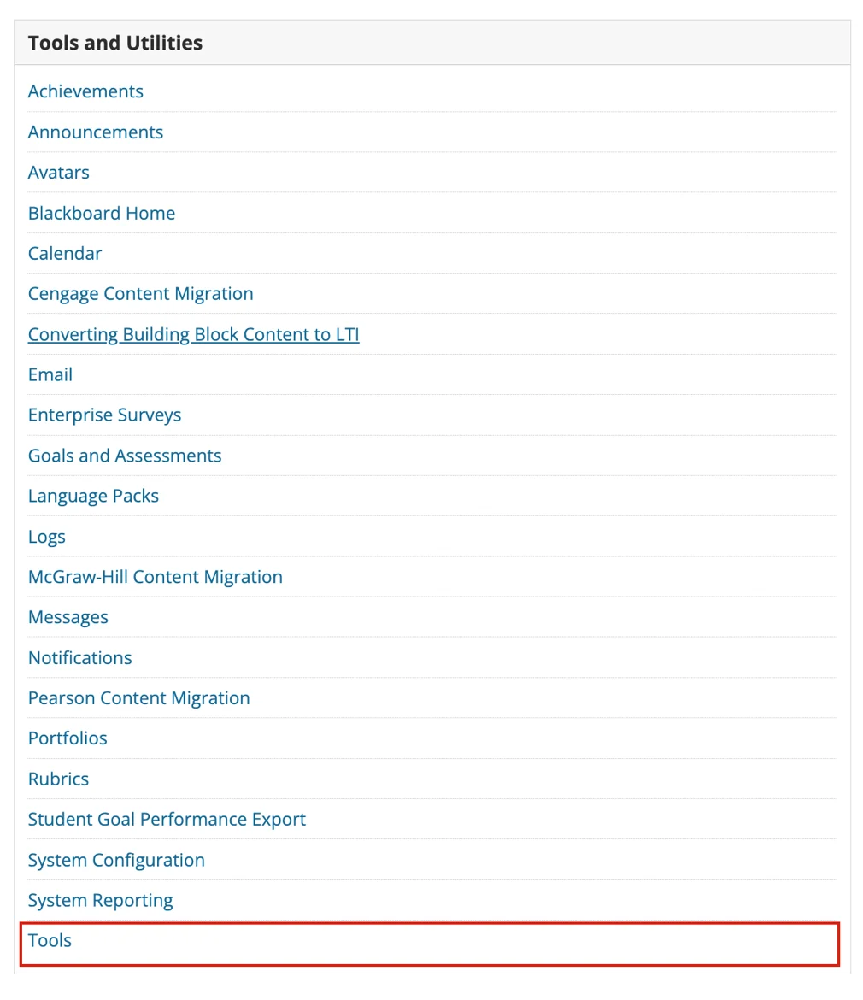
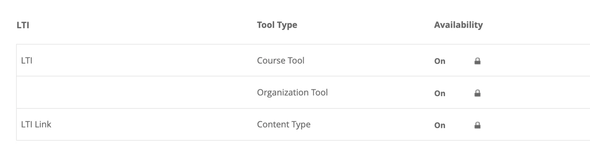
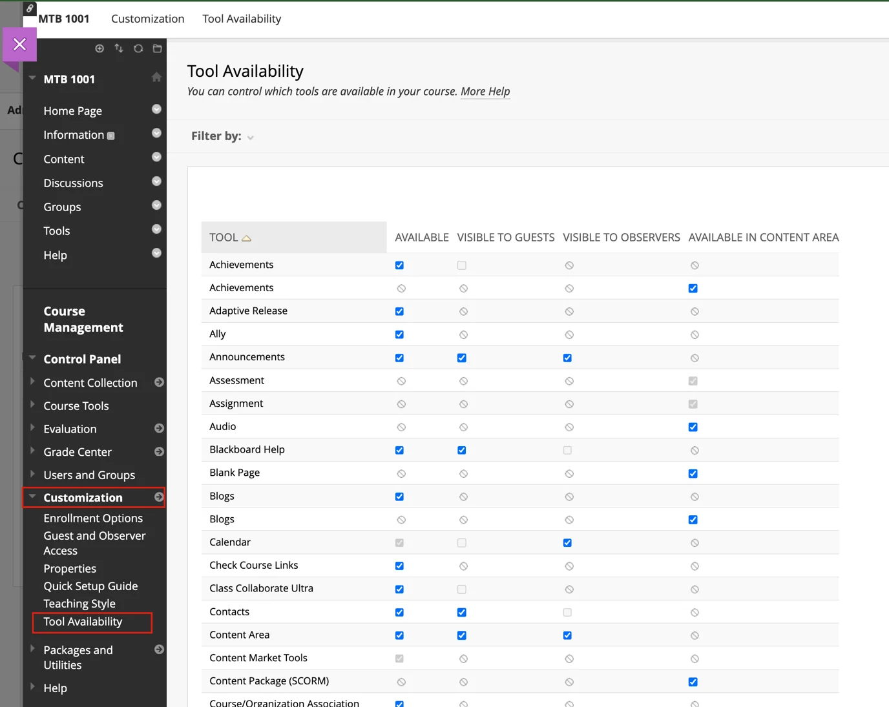

# Blackboard


The following set of instructions apply for both Blackboard Classic and Blackboard Ultra.


## Step 1: Registration

#### Register the EXAMIND LTI Tool in Blackboard

Log in with an administrator account and navigate to the Blackboard Administrator Panel by going to Admin > LTI Tool Providers.

Click on Register LTI 1.3/Advantage Tool.

<figure><figcaption></figcaption></figure>

The Client ID will differ depending on whether you're connecting to EXAMIND's Data Center in Canada or the USA. Please contact [**support@examind.io**](mailto:support@examind.io) to request the Client ID.

After submitting, you will see the Modify LTI 1.3 Tool: EXAMIND panel, where most fields will be automatically filled. Make sure to set the Domain correctly to either lti.examind.io or lti-ca.examind.io. The tool status should be set to Approved.


Please save the deployment ID and send it to your EXAMIND representative


<figure><figcaption></figcaption></figure>

Under Institution Policies, all options should be selected. This includes Role in Course, Name, Email Address, and "Yes" for Allow grade service access and Allow Membership Service Access.

<figure><figcaption></figcaption></figure>

Select Submit.

### Step 1.1: Create a Placement (if not automatically created)


A placement is usually created automatically during registration. Only follow these steps if it was not. Without at least one placement, the tool will not appear in the Content Market even though the tool provider is registered and approved.


1. In the **LTI Tool Providers** list, click the dropdown arrow next to **EXAMIND** to expand its menu, then select **Manage Placements**.

   <!-- SCREENSHOT: EXAMIND dropdown menu open showing Manage Placements option -->

2. Click **Create Placement** and fill in the following fields:
   - **Label**: `EXAMIND` (this is the display name shown to instructors in the course)
   - **Handle**: a unique identifier with no spaces (e.g. `examind-lti`)
   - **Availability**: Yes
   - **Type**: **Deep Linking content tool**, with **Allow student access** checked
   - **Target Link URI**:
     - US data center: `https://lti.examind.io`
     - Canadian data center: `https://lti-ca.examind.io`

   <!-- SCREENSHOT: filled-in Create Placement form -->

3. Click **Submit**.

***

## Step 2: Enable LTI Tools

### **Step 2.1 Enable LTI Tools in the Administrator Panel**

To enable LTI tools in Blackboard, you can do so by accessing the admin panel, finding the Tools and Utilities card (located on the lower right-hand side of the page), and selecting the tools option.

<figure><figcaption></figcaption></figure>

Navigate to the LTI section and ensure all options are set to ON.

<figure><figcaption></figcaption></figure>

Select Submit.

### Step 2.2 Enable LTI Tools in a course (Blackboard classic)

In Blackboard Classic, it is important to make sure that LTI Tools are activated in every course. This can be confirmed by either an administrator or the course instructor.

Navigate to Customization in the left hand menu, and select Tool Availability.

<figure><figcaption></figcaption></figure>

Ensure that both LTI and LTI Link are enabled.

<figure><figcaption></figcaption></figure>

***

## Step 3: Assessment Deeplink

Refer to [Assessment Deeplink](../../get-started/lms-integrated/assessment-deeplink/#blackboard) for instructions on how to link a Blackboard assessment to an EXAMIND assessment.

## More Information

The section **Add an LTI 1.3/Advantage Tool** in [Blackboard's Learning Tools Interoperability page](https://help.blackboard.com/Learn/Administrator/SaaS/Integrations/Learning_Tools_Interoperability) details the steps to install an LTI.
