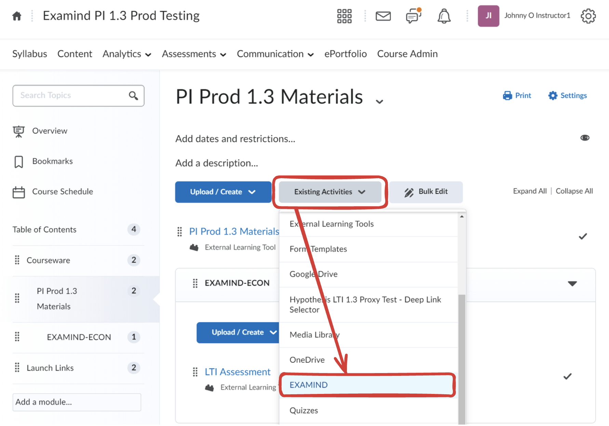
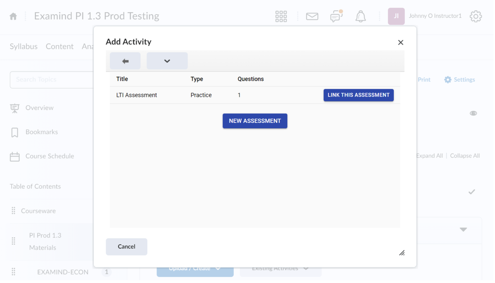
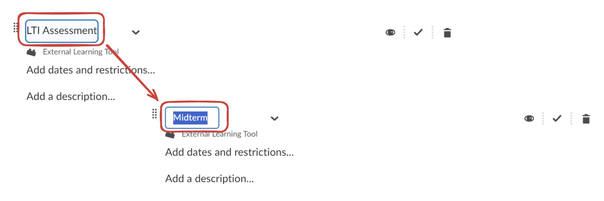
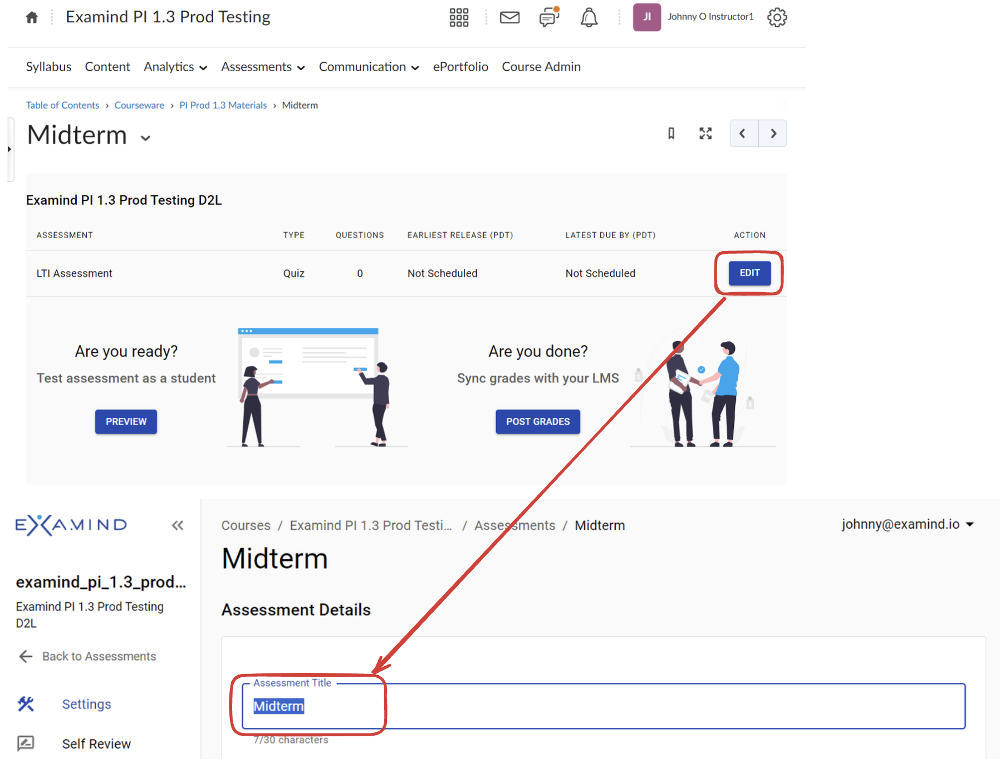

# Brightspace

## Step 1: Install LTI Tool

Follow the steps in D2L's [Tool Registration, Deployment, and Links](https://community.d2l.com/brightspace/kb/articles/23662-tool-registration-deployment-and-links) page to install EXAMIND as an LTI Tool into Brightspace.

Note the following settings that are specific to EXAMIND:



**Instructions for Step 3**

Choose Dynamic For Dynamic Registration URL, use one of the following:

* For US data center users: https://lti.examind.io/register
* For Canadian data center users: https://lti-ca.examind.io/register



**Instructions for Step 4**

Select both **Send Institution Role** and **Send Context Role**



**Instructions for Step 5**

Select the following:

* $CourseOffering.title
* $CourseSection.label
* $CourseSection.sourcedId
* $CourseSection.title
* $CourseSection.timeFrame.begin
* $CourseSection.timeFrame.end
* $Person.email.primary
* $Person.name.family
* $Person.name.full
* $Person.name.given
* $Person.sourcedId
* $ResourceLink.available.startDateTime
* $ResourceLink.available.endDateTime
* $ResourceLink.description
* $ResourceLink.submission.endDateTime
* $ResourceLink.title
* $User.id
* $User.username



**Instructions for Step 6**

Leave blank



## Step 2: Link Assessment

Go to a course in Brightspace, then select **Existing Activities**, then **EXAMIND** (or a different name selected during **LTI Tool Installation**):

<figure><figcaption></figcaption></figure>

If this is your first time adding an assessment into this Brightspace course, you'll be asked to select an EXAMIND course to link this course to.

Either select an existing course in EXAMIND or create a new one:

<figure><figcaption></figcaption></figure>

If you've already linked an EXAMIND course, you'll be asked to select an assessment in EXAMIND. Either select an existing assessment or create a new one:

<figure><figcaption></figcaption></figure>

If you select the New Assessment option, by default it will be named **LTI Assessment**. Rename it in Brightspace:

<figure><figcaption></figcaption></figure>

Open the activity, click Edit, and rename it in EXAMIND:

<figure><figcaption></figcaption></figure>

EXAMIND's assessment is now available as an activity in Brightspace.
