# Canvas


It should take no more than 15 minutes of work to get EXAMIND LTI set up, but the total elapsed time may span a couple of days due to a couple of back and forth communication that are required.

To minimize this time, please complete the first 4 steps and send the information requested in step 4 (**Send Platform Information to EXAMIND**) to EXAMIND as soon as possible.


## Step 1: Add Developer Key

From the Canvas **Admin** / **Developer Keys** page, click the **+ Developer Key** button, then select **+ LTI Key**:

<figure>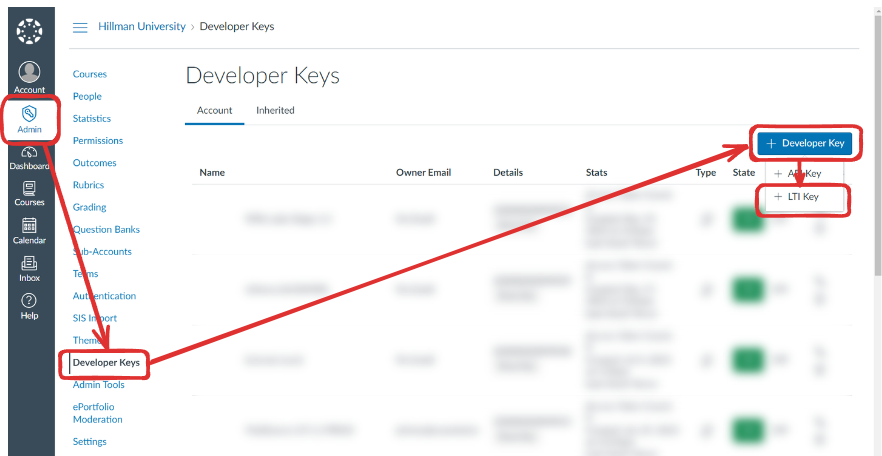<figcaption></figcaption></figure>

Enter **EXAMIND** for **Key Name**, then for the **Method**, select **Enter URL**, then paste one of the following URLs in the **JSON URL** box:

* **For US data center users -** https://lti.examind.io/developer-keys/canvas
* **For Canadian data center users -** https://lti-ca.examind.io/developer-keys/canvas

<figure>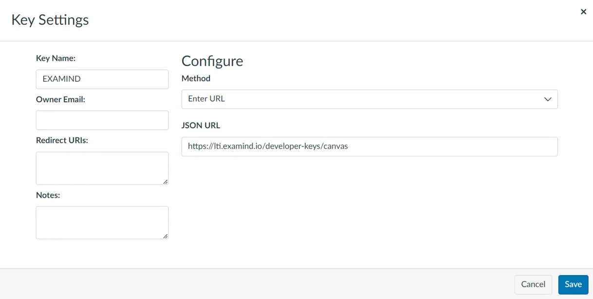<figcaption></figcaption></figure>

Click **Save.**

***

## Step 2: Turn State On

The developer key state is OFF by default. Make sure to turn it on by clicking ON:

<figure>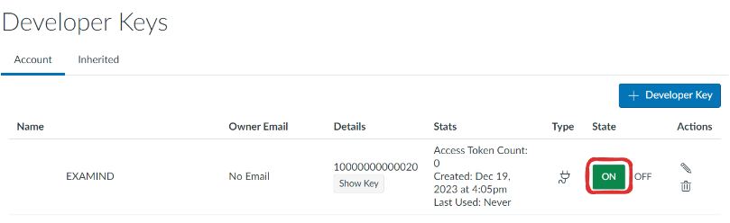<figcaption></figcaption></figure>

***

## Step 3: Add External App

Make note of the Client ID and copy it to your clipboard:

<figure>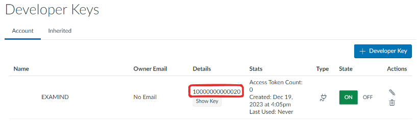<figcaption></figcaption></figure>

From the **Settings** / **Apps** page, click the **+ App** button:

<figure>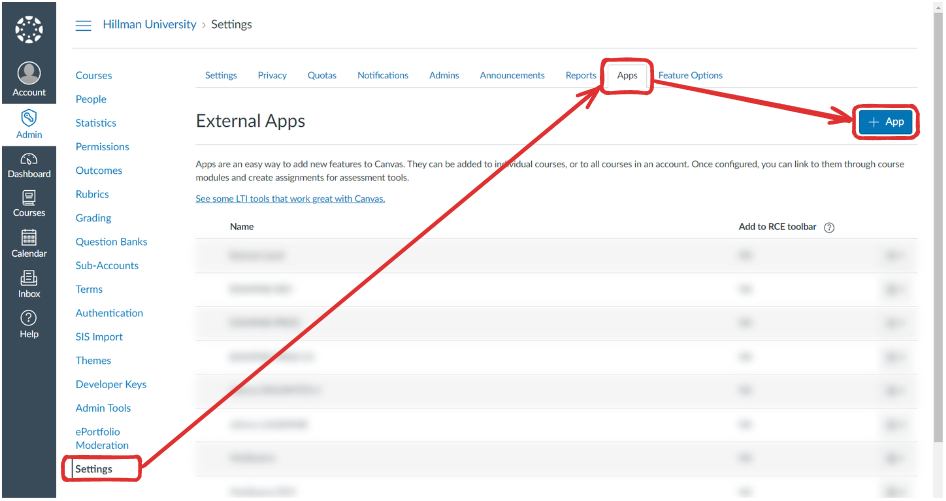<figcaption></figcaption></figure>

Choose **By Client ID** for **Configuration Type** and paste your **Client ID**:

<figure>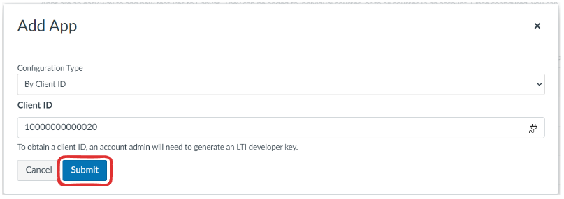<figcaption></figcaption></figure>

When asked if you really want to proceed, click **Install**:

<figure>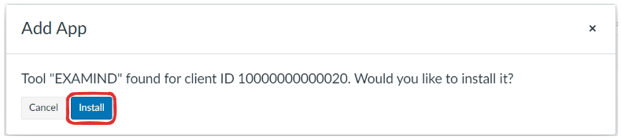<figcaption></figcaption></figure>

***

## Step 4: Send Info to EXAMIND

Now that an External App has been added for EXAMIND, please send the following information to [**support@examind.io**](mailto:support@examind.io) so that we can register your platform:

* Your production and test Canvas Instance URLs (e.g.: https://canvas.hillman.edu and https://hillmanedu.test.instructure.com)
* The Client ID that Canvas generated in step 3

***

## Step 5: Link Assessment

Go to a course in Canvas, then in the **Assignments** page, click the **+ Assignment** button:

<figure>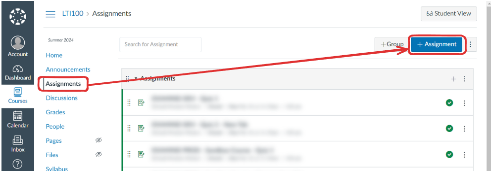<figcaption></figcaption></figure>

Enter an **Assignment Name** and set the appropriate **Points:**

<figure><figcaption></figcaption></figure>

For **Submission Type**, select **External Tool**, then click **Find**:

<figure>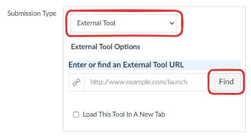<figcaption></figcaption></figure>

Select the EXAMIND LTI Tool:

<figure>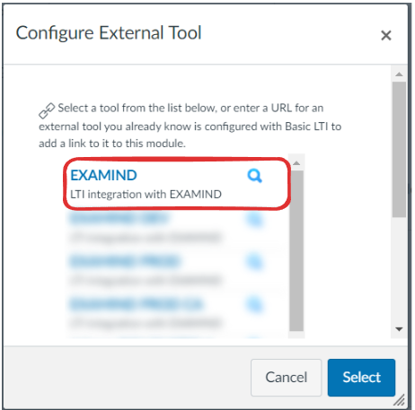<figcaption></figcaption></figure>

If this is the first time you launch LTI Connect for EXAMIND, you will encounter the following error message. An automatic notification will have already been sent to EXAMIND's support team to take action. If this happens during regular business hours, we will resolve this issue within a couple of hours and notify you by email when this is done.&#x20;


If you skipped **Step 4 (Send Platform Information to EXAMIND)** for any reason, now would be a good time to send the requested information to [**support@examind.io**](mailto:support@examind.io), as we can't proceed with platform registration without that information.


<figure>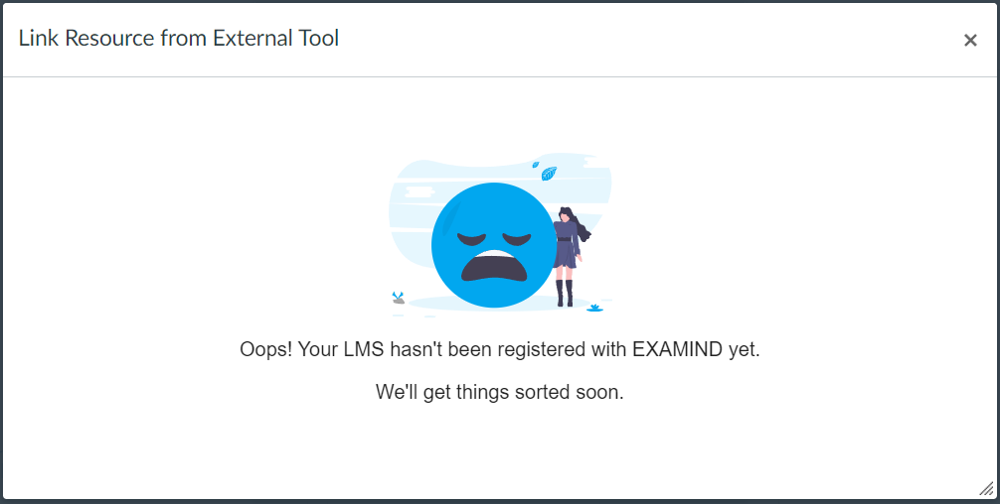<figcaption></figcaption></figure>

Once your Canvas platform is registered, try again:

<figure>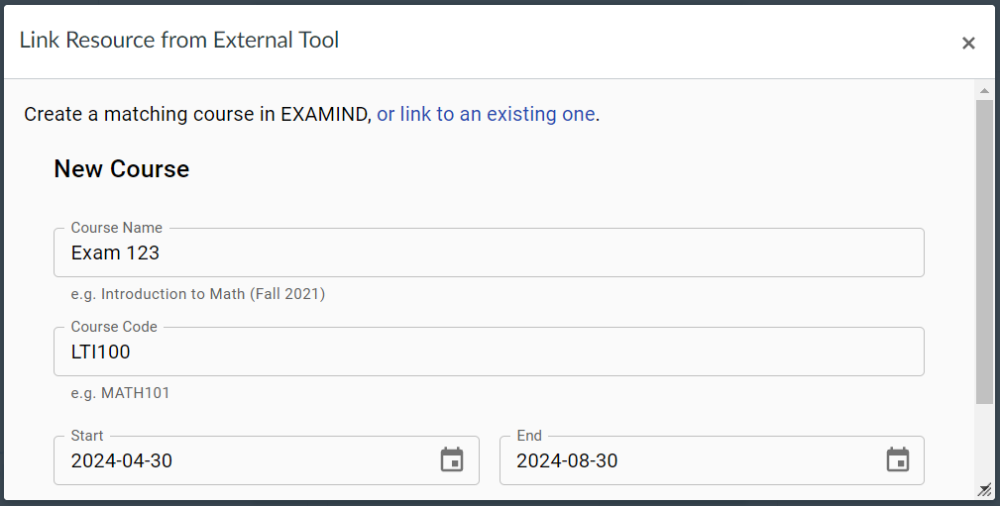<figcaption></figcaption></figure>

From this point forward, [linking an assessment in EXAMIND to an assignment in Canvas](../../get-started/lms-integrated/assessment-deeplink/#canvas) can be done by the instructor without administrator involvement.
