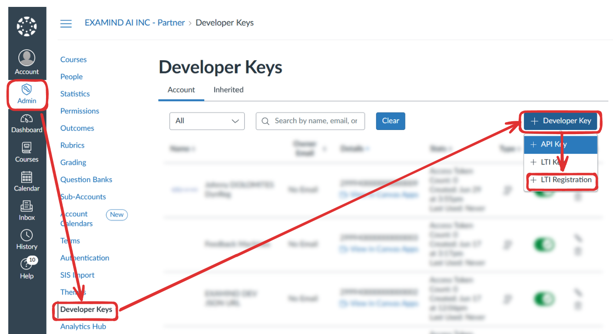
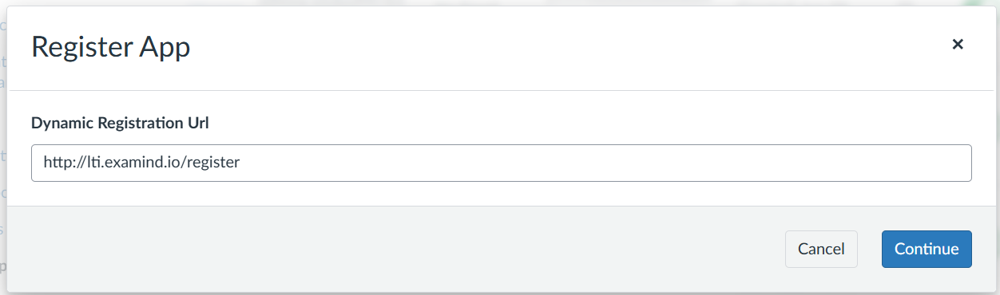
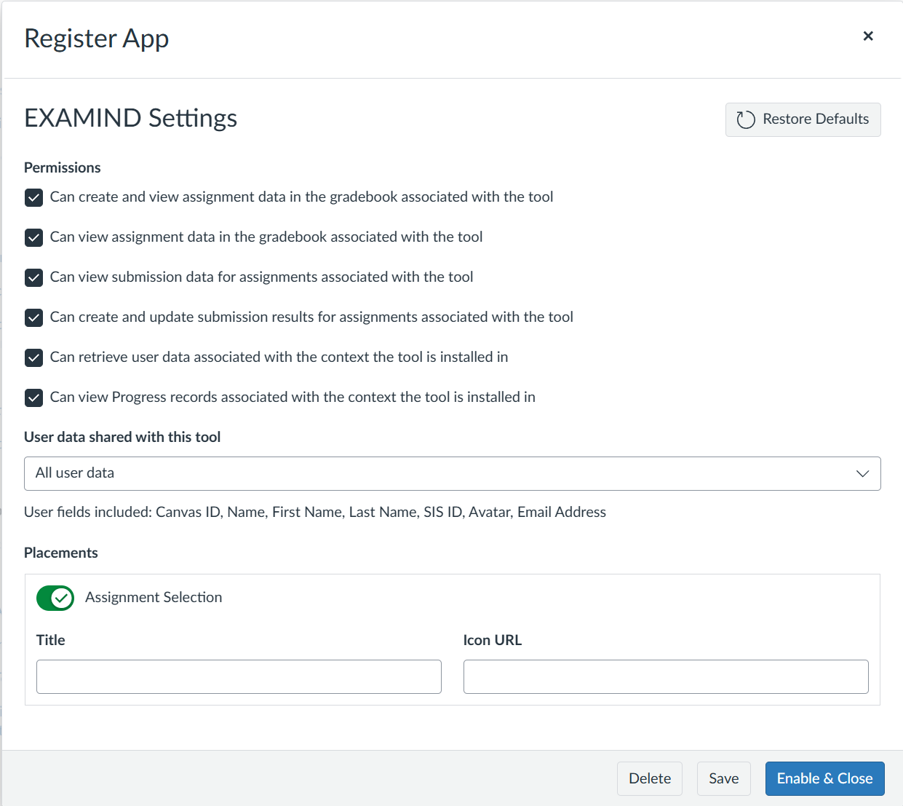
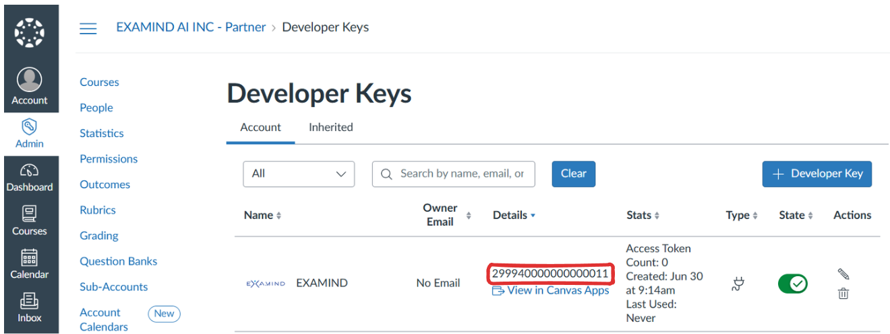
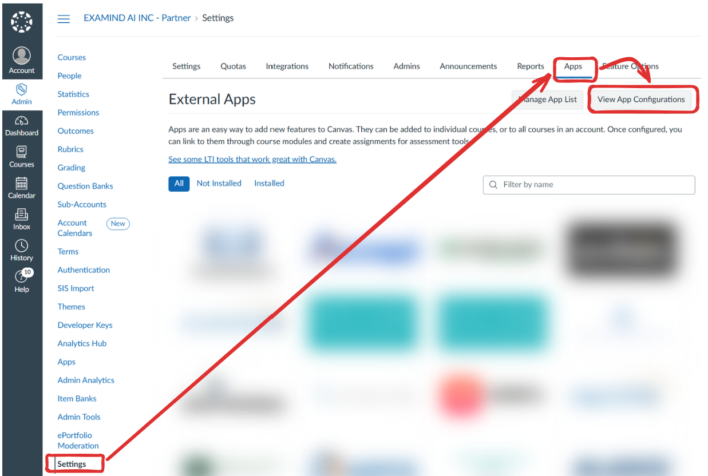
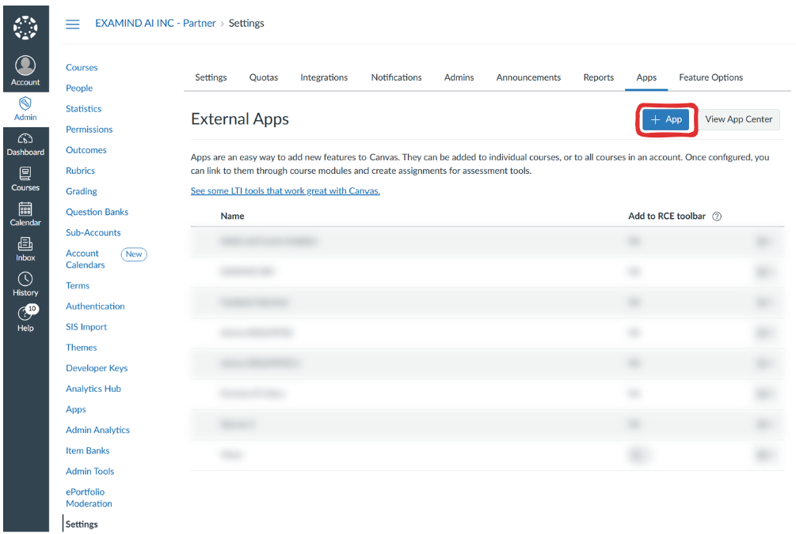
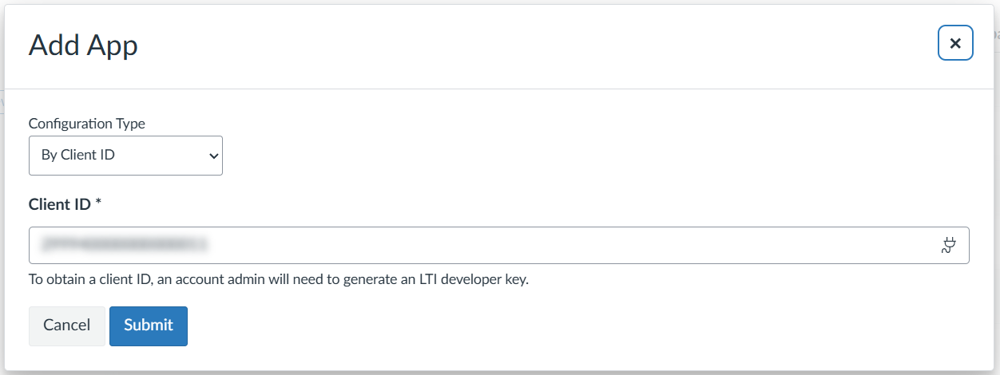
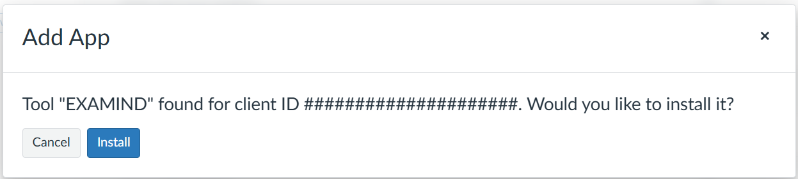
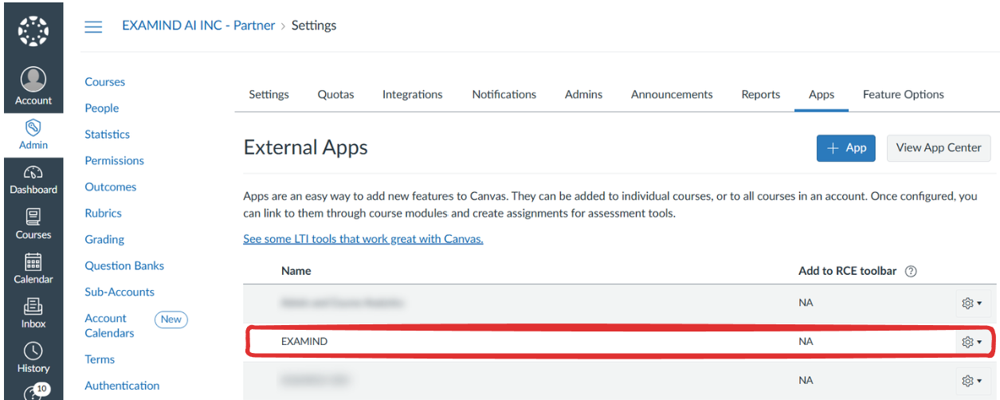

# Canvas


EXAMIND supports two ways to install its LTI tool in Canvas. **Dynamic Registration is the recommended method** — it configures the developer key automatically from a single URL. A manual **JSON URL** method is available as a fallback (see [Alternative: install with a JSON URL](#alternative-install-with-a-json-url)).

Setup takes about 15 minutes of work, but total elapsed time may span a day or two because EXAMIND needs to activate your integration (see Step 4). To minimize the wait, send the information requested in **Step 4** as early as possible.


## Step 1: Register EXAMIND via Dynamic Registration

From the Canvas **Admin** / **Developer Keys** page, click the **+ Developer Key** button, then select **+ LTI Registration**:

<figure><figcaption></figcaption></figure>

Enter the **Dynamic Registration URL** for your data center, then click **Continue**:

* **US data center —** `https://lti.examind.io/register`
* **Canadian data center —** `https://lti-ca.examind.io/register`

<figure><figcaption></figcaption></figure>

Canvas and EXAMIND exchange the configuration automatically. Review the permissions, user data, and placement, then click **Enable & Close**:

<figure><figcaption></figcaption></figure>

The developer key is created and enabled — there's no separate step to turn it on.

***

## Step 2: Copy the Client ID

On the **Developer Keys** page, find the **EXAMIND** key and copy its **Client ID** (the number shown in the **Details** column):

<figure><figcaption></figcaption></figure>

***

## Step 3: Add EXAMIND as an External App

From the **Settings** / **Apps** page, click **View App Configurations**:

<figure><figcaption></figcaption></figure>

Click the **+ App** button:

<figure><figcaption></figcaption></figure>

For **Configuration Type**, select **By Client ID**, paste your **Client ID**, then click **Submit**:

<figure><figcaption></figcaption></figure>

When asked to confirm, click **Install**:

<figure><figcaption></figcaption></figure>

EXAMIND now appears in your list of external apps:

<figure><figcaption></figcaption></figure>

***

## Step 4: Send your Client ID and Canvas URLs to EXAMIND

EXAMIND is notified automatically when you register, but we still need two things from you to finish activating your integration. Please email the following to [**support@examind.io**](mailto:support@examind.io):

* **Your Client ID** (from Step 2) — so we can match your registration to your institution.
* **Your production and test Canvas instance URLs** (e.g. `https://canvas.hillman.edu` and `https://hillmanedu.test.instructure.com`) — so we can allow EXAMIND to be embedded within your Canvas pages.

Once we receive this, we'll activate your integration and notify you by email.

***

## Step 5: Link an Assessment

Once your integration is active, instructors can [link an EXAMIND assessment to a Canvas assignment](../../get-started/lms-integrated/assessment-deeplink/#canvas) without administrator involvement.

***

## Alternative: install with a JSON URL

If your environment can't use Dynamic Registration, you can create the developer key manually from a JSON URL. This replaces **Step 1** only — the remaining steps are identical.

From the **Admin** / **Developer Keys** page, click **+ Developer Key**, then select **+ LTI Key**. Enter **EXAMIND** for the **Key Name**, set **Method** to **Enter URL**, and paste the **JSON URL** for your data center:

* **US data center —** `https://lti.examind.io/developer-keys/canvas`
* **Canadian data center —** `https://lti-ca.examind.io/developer-keys/canvas`

Click **Save**. Unlike Dynamic Registration, a key created this way is **OFF** by default — switch its **State** to **ON**.

Then continue from [**Step 2: Copy the Client ID**](#step-2-copy-the-client-id) above.
