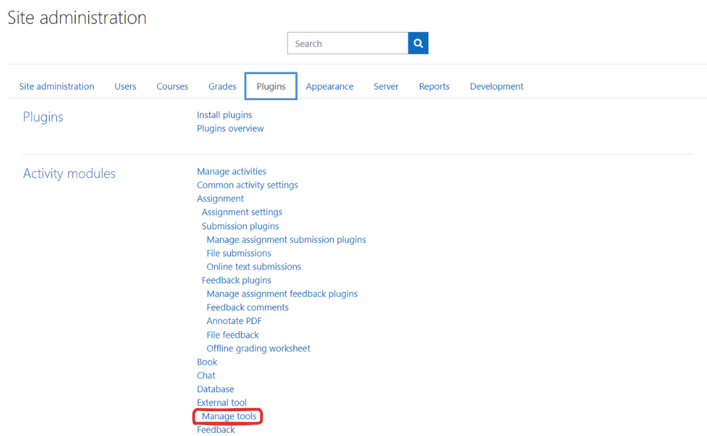
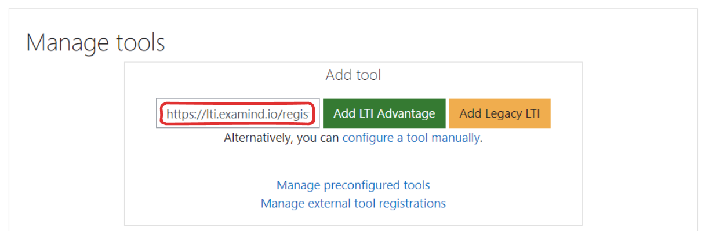
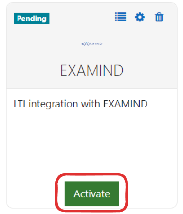
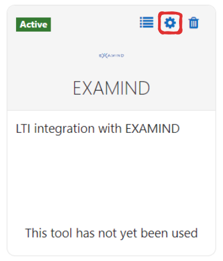
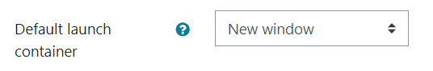
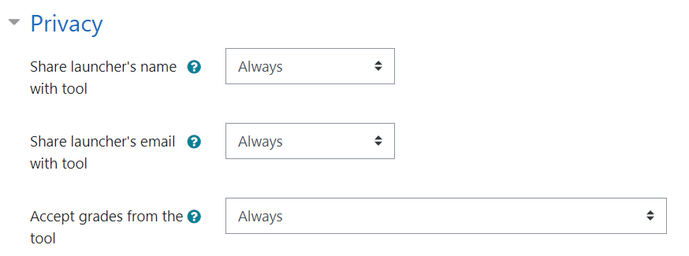

# Moodle


It should take no more than 15 minutes of work to get EXAMIND LTI set up, but the total elapsed time may span a couple of days due to a couple of back and forth communication that are required.

To minimize this time, please complete **Step 1 (Send Moodle Instance URL to and Email Addresses to EXAMIND)** below. Although not required, it would also streamline the process to have an EXAMIND support staff on standby when you launch LTI Connect for the very first time.


## Step 1: Send info to EXAMIND

In order for EXAMIND's iframe to load within your Moodle instance, EXAMIND must white-list your Moodle domain by adding it to its _content-security-policy_ HTTP header. Please send us your production and test Moodle Instance URLs (examples: https://moodle.hillman.edu and https://hillmanedu.test.moodle.com).

Information can be emailed to [**support@examind.io**](mailto:support@examind.io).

***

## Step 2: Add External Tool

From the Moodle **Site administration** / **Plugins** page, click the **External Tool** / **Manage tools** link:

<figure><figcaption></figcaption></figure>

In the **Tool URL...**, enter the following:

* For US data center users: https://lti.examind.io/register
*   For Canadian data center users: https://lti-ca.examind.io/register

    <figure><figcaption></figcaption></figure>

Click **Add LTI Advantage**

You will see a new tool with the name EXAMIND appear in your list. Click **Activate**:

<figure><figcaption></figcaption></figure>

***

## Step 3: Configure LTI Tool

Click the gear icon next to the EXAMIND tool:

<figure><figcaption></figcaption></figure>

Set the **Default launch container** to **New Window**, otherwise your students may encounter a 3rd party cookie error:

<figure><figcaption></figcaption></figure>

In **Privacy**, ensure **Share launcher's name with tool**, **Share launcher's email with tool**, and **Accept grades from the tool** are all **Always**.

<figure><figcaption></figcaption></figure>

Click **Save changes**:

***

## Step 4: Assessment Deeplink

Refer to [Assessment Deeplink](../../get-started/lms-integrated/assessment-deeplink/#moodle) for instructions on how to link a Moodle activity to an EXAMIND assessment.
