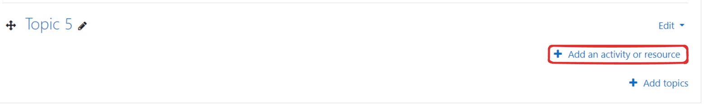
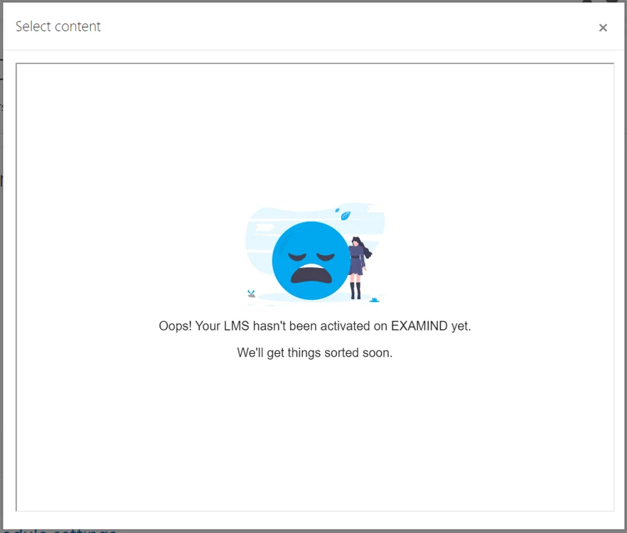
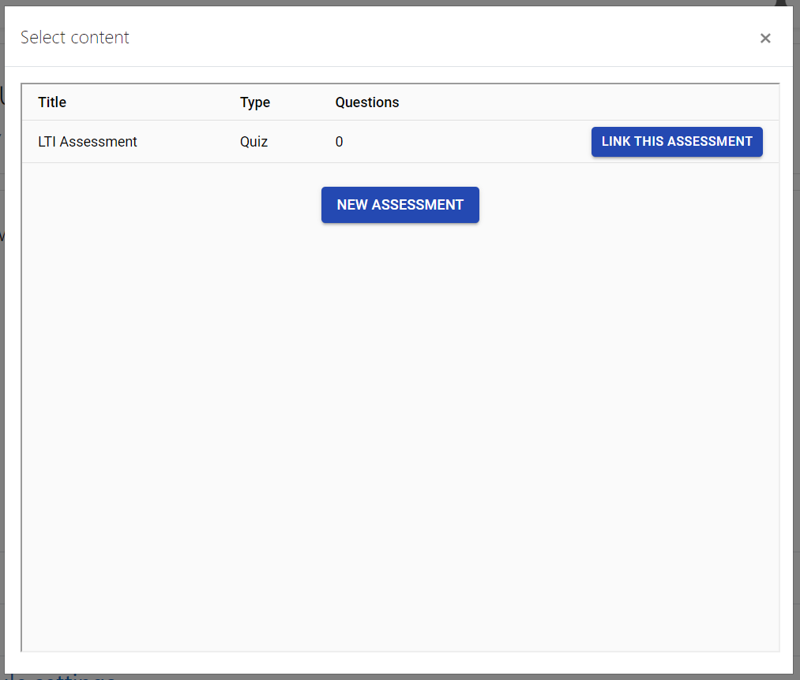

# Moodle


It should take no more than 15 minutes of work to get EXAMIND LTI set up, but the total elapsed time may span a couple of days due to a couple of back and forth communication that are required.

To minimize this time, please complete **Step 1 (Send Moodle Instance URL to and Email Addresses to EXAMIND)** below. Although not required, it would also streamline the process to have an EXAMIND support staff on standby when you launch LTI Connect for the very first time. \



## Step 1: Send info to EXAMIND

In order for EXAMIND's iframe to load within your Moodle instance, EXAMIND must white-list your Moodle domain by adding it to its _content-security-policy_ HTTP header. Please send us your production and test Moodle Instance URLs (examples: https://moodle.hillman.edu and https://hillmanedu.test.moodle.com).

Information can be emailed to [**support@examind.io**](mailto:support@examind.io).

***

## Step 2: Add External Tool

From the Moodle **Site administration** / **Plugins** page, click the **External Tool** / **Manage tools** link:

<figure><figcaption></figcaption></figure>

In the **Tool URL...**, enter the following:

* For US data center users: https://lti.examind.io/register
*   For Canadian data center users: https://lti-ca.examind.io/register

    <figure><figcaption></figcaption></figure>

Click **Add LTI Advantage**

You will see a new tool with the name EXAMIND appear in your list. Click **Activate**:

<figure><figcaption></figcaption></figure>

***

## Step 3: Configure LTI Tool

Click the gear icon next to the EXAMIND tool:

<figure><figcaption></figcaption></figure>

Set the **Default launch container** to **New Window**, otherwise your students may encounter a 3rd party cookie error:

<figure><figcaption></figcaption></figure>

In **Privacy**, ensure **Share launcher's name with tool**, **Share launcher's email with tool**, and **Accept grades from the tool** are all **Always**.

<figure><figcaption></figcaption></figure>

Click **Save changes**:

***

## Step 4: Link Assessment

Go to a course in Moodle, then click the **Turn editing on** button:

<figure><figcaption></figcaption></figure>

Click **+ Add an activity or resource** on any topic (Topic 5 in the example below):

<figure><figcaption></figcaption></figure>

&#x20;Select **External Tool**:

<figure><figcaption></figcaption></figure>

Leave **Activity name** blank for now; it will auto-populate. Choose **EXAMIND** from the **Preconfigured tool** dropdown, then click the **Select Content** button:

<figure><figcaption></figcaption></figure>


If this is the first time you launch LTI Connect for EXAMIND, you may encounter this error message. An automatic notification will have already been sent to EXAMIND's support team to take action. If this happens during regular business hours, we will resolve this issue within a couple of hours and notify you by email when this is done.

You may also wish to contact us at [**support@examind.io**](mailto:support@examind.io) at this time.


<figure><figcaption></figcaption></figure>

Once your platform is activated, try again:

<figure><figcaption></figcaption></figure>

Create a new linked course in EXAMIND or select an existing course that you'd like to link:

<figure><figcaption></figcaption></figure>

Select the assessment that you'd like to link:

<figure><figcaption></figcaption></figure>

Click the **Save and return to course** button:

<figure><figcaption></figcaption></figure>

EXAMIND's LTI is now available as an assignment in Moodle.

***

## Troubleshooting Tips

If you don't see any courses or assessments to link to in EXAMIND, go to the instructor portal and create a course and assessment:

* In the US: [https://instructor.examind.io/](https://instructor.examind.io/)&#x20;
* In Canada: [https://instructor-ca.examind.io/](https://instructor-ca.examind.io/)
